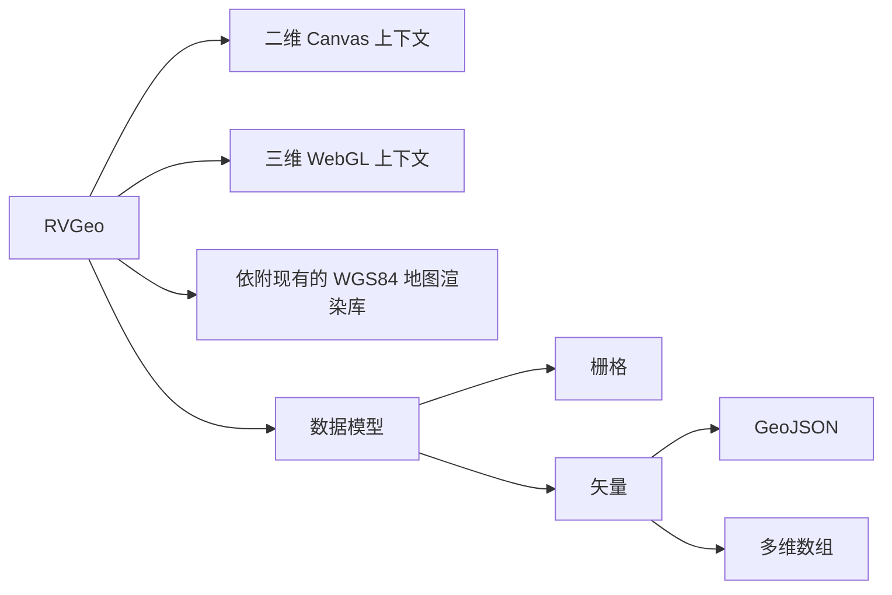

# RVGeo V 2.0
> - RVGeo (V2.0.0) is now available on [npm](https://www.npmjs.com/package/rvgeo).
> - You could get some tutorials from this [site](https://pzq123456.github.io/RVGeo/tutorials/index.html)
> - [more information](https://pzq123456.github.io/RVGeo/)
## 本包的潜在优势 | Potential Advantages
- 便捷快速地引入基础空间分析算法
- Conviniently import basic spatial analysis algorithms
- 跨地图服务商的一致性开发体验
- Consistent development experience across map service providers
## 定位
- 赋予前端地图以基础空间分析及计算能力。当前一些前端地图库，重视觉效果，轻空间分析，使用者往往需要自己编写冗长的业务代码才能实现一些在桌面应用中极容易实现的功能（例如空间插值、空间求交、投影等）。
- In order to give front-end maps basic spatial analysis and calculation capabilities. Some of the current front-end map libraries focus on visual effects and light spatial analysis. Users often need to write long business code to achieve some functions that are extremely easy to implement in desktop applications (such as spatial interpolation, spatial intersection, projection, etc.).
- 我希望参考一些经典的 GIS 系统的底层包（AO、AE、GeoTools等）的设计，结合时下流行的前端地图及数据可视化包，使用 TypeScript 语言构建一款功能强大的前端 GIS 工具库。
- I hope to refer to the design of some classic GIS system's underlying packages (AO, AE, GeoTools, etc.), combined with popular front-end map and data visualization packages, using the TypeScript language to build a powerful front-end GIS tool library.
- 探索：在按部就班地实现基础空间分析功能的同时，我希望继续围绕“好用”这一中心探索新的功能。目前已经确定要实现的功能大致包括，时空立方体，地形的三维渲染等。这一块的代码将单独组织，等建立起社区后再逐步集成。
- Exploration: While implementing basic spatial analysis functions in an orderly manner, I hope to continue to explore new functions around the center of "easy to use". The functions that have been determined to be implemented include space-time cubes, three-dimensional rendering of terrain, etc. The code in this area will be organized separately, and will be gradually integrated after the community is established.
## 总览 | Overview
> - 以下内容为暂定设计稿件。打 “*” 的模块处于待定状态，有可能会并入其他模块。
> - The following content is a tentative design draft. The modules marked with "*" are in a pending state and may be merged into other modules.


> 图片说明：
>  - 虚线框中代表尚未实现（或正在实现）的模块
> - The dashed box represents the module that has not been implemented (or is being implemented)
>  - 模块在纵向存在依赖（一定的）关系，且左侧部分为矢量数据提供支持，右侧为栅格数据
> - The modules have a (certain) dependency relationship in the vertical direction, and the left part provides support for vector data, and the right part is raster data
>  - 核心包与插件系统：紫色实线矩形代表 RVGeo 2.0 的核心包，蓝色虚线矩形代表数据 I/O 插件（设计用于解析和生成不同格式的数据），顶部灰色虚线矩形代表渲染引擎
> - Core package and plug-in system: The purple solid rectangle represents the core package of RVGeo 2.0, the blue dashed rectangle represents the data I/O plug-in (designed to parse and generate data in different formats), and the top gray dashed rectangle represents the rendering engine
>  - Renderer Engine 模块：该模块采用类似于 UNIX 的插件思想，将封装不同的地图服务提供商的API以实现一套统一的基础图形绘制方法，以获得跨地图服务的一致开发体验。另外，该模块还将集成三维地形渲染与基础图表渲染。现考虑将其作为独立于 RVGeo 核心包的插件库发布。
> - Renderer Engine module: This module adopts a plug-in idea similar to UNIX to encapsulate the APIs of different map service providers to achieve a unified set of basic graphics drawing methods in order to obtain a consistent development experience across map services. In addition, the module will also integrate three-dimensional terrain rendering and basic chart rendering. Now consider releasing it as a plug-in library independent of the RVGeo core package.
>  - 开发阶段架构可能会有所出入，预计（从现在起）一年左右逐步稳定下来。
> - The development stage architecture may change, and it is expected to stabilize gradually (from now on) in about a year.
### 1. Data I/O Module
该模块封装了 `axios` 包用以获取数据，暂时实现了 `GeoJSON` 及 `CSV` 数据格式的读取与转换。该模块一般将数据解析为多维数组（中间格式），并传递给 `Meta` 模块用以产生内置 `Geometry` 或 `Coverage` 对象。
### 2. Meta Module
该模块类似于工厂函数，用于生成基于 `GeoJSON` 标准的内置几何对象（栅格对象采用另外的格式，待定）。

### 3. Geometry Moudle
基于 `GeoJSON` 标准，该模块内部维护了对应的几何对象，主要包括：
  - `Point`
  - `MultiPoint`
  - `LineString`
  - `MultiLineString`
  - `Polygon`
> 注意：出于易用性的考虑，这些几何类仅包含最基础的数据操作，复杂的空间算法并未封装进这些类中。

### 4. Coverage Module （实现中...）
该模块的数据结构由两部分组成：代表栅格数据的多维数组和代表（矢量）地理覆盖的矩形对象。可通过简单的分割算法将栅格多维数组均匀地分配到地理覆盖矩形的各个格网中。该数据结构可以尽量做到与 `GeoJSON` 中的 `Polygon` 相兼容。

### 5. Unit 
该模块主要用于处理单位换算问题，支持多种单位的互相转换，转换参数以常数的形式记录并提供一些工具函数方便用户进行快速单位换算。（精度仅与一般 `JavaScript` 计算精度保持一致）

### 6. Reference
该模块主要用于坐标系转换，目前仅实现了 `WGS84` 与 Web 墨卡托坐标系的互相转换。(epsg:4326 <---> epsg:3857) 也就是（椭）球面坐标系与平面坐标系之间的（部分）相互转换。

### 7*. Colors
该模块的本质是数值到颜色的映射函数，矢量与栅格都要用到。本应该置于可视化层级（渲染层），但是考虑到 `数值-颜色` 映射功能在 `GIS` 中十分基础，且想要尝试一些颜色方面的计算（实验性功能）故把它也放在整个架构的最底层。

> - 以上就是 RVGeo 的基础模块，这些简单的模块是下一步更加复杂模块的基础。另外，我们也将 `GeoJSON` 的规则使用 `TypeScript` 中的类部分实现，这些基础模块是维持包接口稳定、规范的重要部分。

### 8. Measuration Module
量测模块，该模块主要用于距离、面积等参数的量测，属于相对基础的功能（但是又需要依赖几何对象）所以位于第二层级。目前主要提供球面与平面两种坐标系下的数值量测功能接口，一般情况下，认为球面量测较为准确（平面量测受到纬度投影变形的影响），也推荐使用球面量测算法。

### 9. Spatial computing Module
空间计算模块，主要是二维的计算几何，日后也会整合三维几何计算的相关算法。目前仅实现了直线求交及（简单）多边形求交。

### 10*. (Grid) Statistic（实现中...）
栅格（格网）统计模块，该模块是进行栅格计算与渲染的基础模块。该模块可能会集成在 Grid 类中，视实现情况而定。

> - 以上是第二层级模块，这些模块为更复杂的功能模块提供了功能基础，同时避免了对底层模块对象的直接操作。

### 11. Delaunay Module
（二维）狄罗妮三角网模块，该模块依赖底层基础模块提供的空间量测与计算能力并为更加复杂的功能模块提供数据结构方面的支持。`Voronoi` 图作为狄罗妮三角网的对偶图也顺带提供。

### 12. Shell Module
壳模块，包括凸包和凸壳（尚未实现），其中凸包可以直接构建，凸壳的构建需要借助三角网。

> - 可以使用以下命令克隆该分支代码：
``` bash
git clone --branch next --single-branch https://github.com/pzq123456/RVGeo.git
```
## 概念及设计
### 坐标系系统 Referencing
#### 大地坐标系 (GCS) 及基准面 (Datum)
#### 投影坐标系 (PCS)

## 一些设想
> 若有使用者对于该代码仓库有任何想法，欢迎与我联系。（issue 或者 email）

总的来说 RVGeo 未来的渲染能力有三个大的分支： 二维 Canvas 上下文、三维 WebGL 上下文、依附现有的 WGS84 地图渲染库（百度地图、高德地图、MapBox等）。数据模型依旧分为栅格和矢量，其中二维渲染器主要渲染数据结构，三维及地图渲染器负责渲染具有实际意义的地理目标。 RVGeo 内部数据组织使用多维数组来维护，对外提供 GeoJSON 对象。



1. 百度地图API：引入百度地图作为底图，采用 WGS84 坐标系下的点。（百度地图国内区域的坐标会进行二次加密，国外则正常 WGS84 坐标系。对于国内区域，会使用官方提供的坐标转换接口。考虑到通用性，样例代码会放在非国内区域，使用 WGS84 坐标系。）
2. 平面坐标系：依旧保留原来的二维 Canvas 上下文及平面坐标系计算能力。二维坐标系与 WGS84 坐标系无法兼容，但是考虑到百度地图 api 支持 Canvas 接口绘制，并且对于小尺度的场景只要做好坐标系定向还是可以直接使用二维坐标系的。（兼容接口会重新设计）
3. 栅格数据：有别与其他地理图形库， RVGeo 具有栅格数据的计算与渲染能力。原本栅格数据与矢量数据共用一套绘制接口，同在一个坐标系下，在二维 Canvas 上下文中绘制。通过颜色条带来渲染不同的栅格值，使用矩阵运算来实现一些栅格（空间）运算能力。
   1. 三维画布：采用 Three.js 在三维场景中渲染地形（DEM）、温度等数据。并整合一定的三维分析能力（洪水淹没模拟、光照渲染等），同时提供简单的材质及光照渲染能力。
   2. 二维 Canvas 上下文：依旧保留原来的二维渲染能力，与上文理由一样，对于小范围可以直接使用二维坐标系绘制，节省计算资源。
   3. 对于栅格数据的一些思考：
      1. 栅格数据本质上是二维（及以上）数组，不考虑投影及空间覆盖，以二维的方式绘制利于检验一些基于二维（及以上）数组的分析算法。如果考虑实际情况，那么每一个栅格都不可能是相同大小的标准正方形（计算机图形方面的模型）。从实际意义上讲，栅格更像是对一定地理范围进行的“均匀采样”。单个栅格值只是对所表示地理区域的一次采样。并且对于一帧（一幅）栅格，每一个栅格覆盖的范围及栅格值的可信度其实是不一样的。
      2. 栅格立方体：对于遥感数据及其他一些具有时间轴的数据，我们可以在三维画布中渲染，并通过截取断面的方式获得新的数据栅格。我们同样使用 Three.js 来绘制栅格立方体，并提供三维栅格数据分析。该功能属于探索性功能，版本迭代时有关方法可能会有较大变化。
4. 内部数据模型：
   1. 唯一的具有地理意义的数据模型：与 GeoJSON 兼容的数据模型，附带属性信息。
   2. 易于处理的数据结构：基于多维列表的数据管理，只涉及最基本的几何对象及其拓扑关系。
   3. 数据转换模块：主要是根据一定的规则将列表中的数据转换为 WGS84 下的坐标。

## 具体实现简要记录
### Ellipsoid
- 该模块用于记录椭球的具体参数信息，包括长半轴、扁率的倒数等。现在只有两个椭球，一个是 WGS 84 所使用的椭球，一个是正球（ 半径为 6370997 ）。

### Distance 
> - 距离量测是其他复杂算法的基础。
- 该模块主要用于计算球面两点间距离，现阶段所有距离计算均使用正球计算。（ TODO ：后续会有特定椭球的高精度 ）
- 考虑到灵活性，本模块并不与诸如 Point 等类耦合，用户只需要输入最简单的经纬度（或 xyz）坐标即可获得单位为米的距离。
- 该模块包含的另一部分是用于聚类（ K-means 等）算法的距离量测，也叫类间距离，每一单一元素的维度将不止 3 。