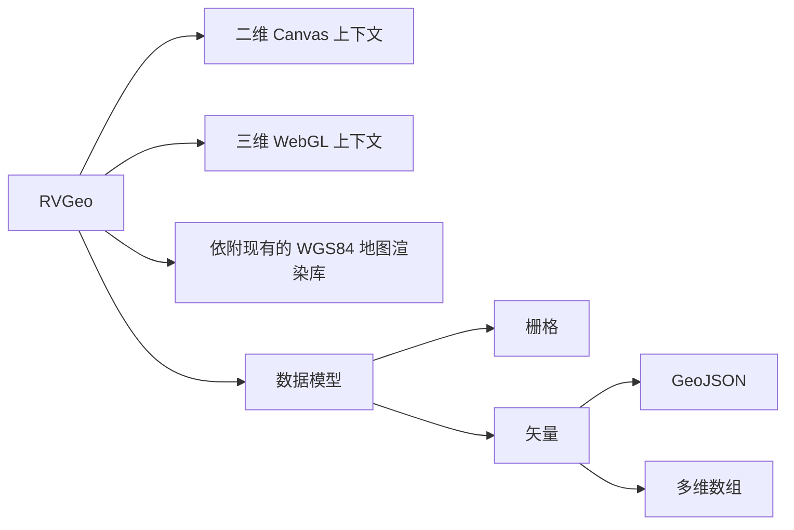

# RVGeo 重构
> next version: V2.X.X
## 重构计划
- 参考 GeoTools 重构 RVGeo
- 标准化代码
- 引入测试框架
- 引入文档生成工具
- https://github.com/torokmark/design_patterns_in_typescript
- https://www.codenong.com/js0dea3b0a4b75/

## 一些设想
> 若有使用者对于该代码仓库有任何想法，欢迎与我联系。（issue 或者 email）

总的来说 RVGeo 未来的渲染能力有三个大的分支： 二维 Canvas 上下文、三维 WebGL 上下文、依附现有的 WGS84 地图渲染库（百度地图、高德地图、MapBox等）。数据模型依旧分为栅格和矢量，其中二维渲染器主要渲染数据结构，三维及地图渲染器负责渲染具有实际意义的地理目标。 RVGeo 内部数据组织使用多维数组来维护，对外提供 GeoJSON 对象。

1. 百度地图API：引入百度地图作为底图，采用 WGS84 坐标系下的点。（百度地图国内区域的坐标会进行二次加密，国外则正常 WGS84 坐标系。对于国内区域，会使用官方提供的坐标转换接口。考虑到通用性，样例代码会放在非国内区域，使用 WGS84 坐标系。）
2. 平面坐标系：依旧保留原来的二维 Canvas 上下文及平面坐标系计算能力。二维坐标系与 WGS84 坐标系无法兼容，但是考虑到百度地图 api 支持 Canvas 接口绘制，并且对于小尺度的场景只要做好坐标系定向还是可以直接使用二维坐标系的。（兼容接口会重新设计）
3. 栅格数据：有别与其他地理图形库， RVGeo 具有栅格数据的计算与渲染能力。原本栅格数据与矢量数据共用一套绘制接口，同在一个坐标系下，在二维 Canvas 上下文中绘制。通过颜色条带来渲染不同的栅格值，使用矩阵运算来实现一些栅格（空间）运算能力。
   1. 三维画布：采用 Three.js 在三维场景中渲染地形（DEM）、温度等数据。并整合一定的三维分析能力（洪水淹没模拟、光照渲染等），同时提供简单的材质及光照渲染能力。
   2. 二维 Canvas 上下文：依旧保留原来的二维渲染能力，与上文理由一样，对于小范围可以直接使用二维坐标系绘制，节省计算资源。
   3. 对于栅格数据的一些思考：
      1. 栅格数据本质上是二维（及以上）数组，不考虑投影及空间覆盖，以二维的方式绘制利于检验一些基于二维（及以上）数组的分析算法。如果考虑实际情况，那么每一个栅格都不可能是相同大小的标准正方形（计算机图形方面的模型）。从实际意义上讲，栅格更像是对一定地理范围进行的“均匀采样”。单个栅格值只是对所表示地理区域的一次采样。并且对于一帧（一幅）栅格，每一个栅格覆盖的范围及栅格值的可信度其实是不一样的。
      2. 栅格立方体：对于遥感数据及其他一些具有时间轴的数据，我们可以在三维画布中渲染，并通过截取断面的方式获得新的数据栅格。我们同样使用 Three.js 来绘制栅格立方体，并提供三维栅格数据分析。该功能属于探索性功能，版本迭代时有关方法可能会有较大变化。
4. 内部数据模型：
   1. 唯一的具有地理意义的数据模型：与 GeoJSON 兼容的数据模型，附带属性信息。
   2. 易于处理的数据结构：基于多维列表的数据管理，只涉及最基本的几何对象及其拓扑关系。
   3. 数据转换模块：主要是根据一定的规则将列表中的数据转换为 WGS84 下的坐标。

## 简单使用教程
[npm page](https://www.npmjs.com/package/rvgeo)