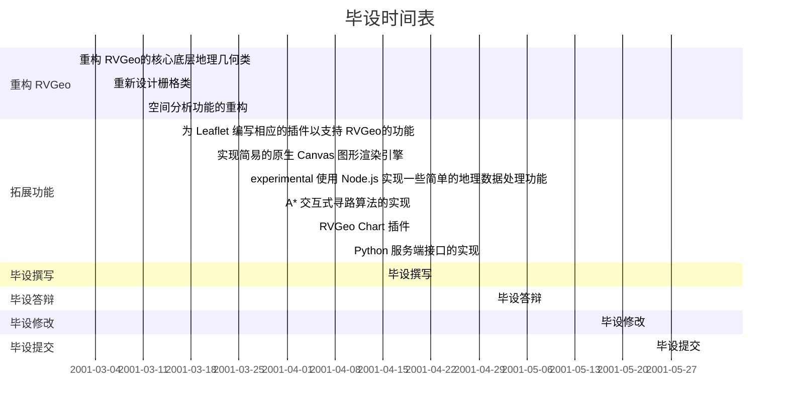

# 参考 Leaflet 重构 RVGeo(V2.5.0) 
> 暂不引入新功能，功能接口会有部分调整。考虑适配 Leaflet

## 0. 重构
将从 LeafLet 源码中学习到的设计模式应用到 RVGeo 中，充分结合 TypeScript 的特性，提高代码的可读性、可维护性、可扩展性。

### 0.1. 重构进度
- [ ] 重构 RVGeo 的核心底层地理几何类 ( 基于 GeoJSON ): Geometry(Polygon, LineString, Point)
- [ ] 重新设计栅格类：Grid
- [ ] 空间分析功能的重构（基于地理几何类的空间分析）

### 0.2. 拓展功能
- [ ] 为 Leaflet 编写相应的插件以支持 RVGeo 的功能（主要是地理几何类的绘制、编辑、查询等功能），后续毕设会在此基础上进行拓展。
- [ ] 实现简易的原生 Canvas 图形渲染引擎，用于绘制栅格类的图形及地理几何类的图形。（作为 RVGeo 的插件，目前主要作为库内部的可视化 Debugger） 
- [ ] `experimental` 使用 Node.js 实现一些简单的地理数据处理功能，如：地理数据的读写、转换、分析等。该功能作为 RVGeo Sever 项目的一部分，用于支持 RVGeo 的后端功能。考虑到这样做可以使前后端基础代码同构。其希望用户使用 RVGeo 的 API 编写的代码可以在前后端无缝切换，这样可以实现任务流转与分布式计算。（可以在前后端实现任务代码的交互，而非仅仅是数据的交互，这样的互操作性是一般的地理数据处理库所不具备的）
- [ ] (待定) A* 交互式寻路算法的实现，主要用于 Demo 演示。
- [ ] (待定) RVGeo Chart 插件，用于绘制地理数据的图表。
- [ ] (待定) Python 服务端接口的实现，用于支持 RVGeo 的后端功能及 AI 算法封装。

### 0.3. 毕设时间表

```mermaid
gantt
    title 毕设时间表
    dateFormat  YYYY-MM-DD
    section 重构 RVGeo
    重构 RVGeo的核心底层地理几何类 :done, des1, 03-01, 03-05
    重新设计栅格类 :done, des2, 03-06, 03-10
    空间分析功能的重构 :done, des3, 03-11, 03-15
    section 拓展功能
    为 Leaflet 编写相应的插件以支持 RVGeo的功能 :done, des4, 03-16, 03-20
    实现简易的原生 Canvas 图形渲染引擎 :done, des5, 03-21, 03-25
    experimental 使用 Node.js 实现一些简单的地理数据处理功能 :done, des6, 03-26, 03-30
    A* 交互式寻路算法的实现 :done, des7, 03-31, 04-04
    RVGeo Chart 插件 :done, des8, 04-05, 04-09
    Python 服务端接口的实现 :done, des9, 04-10, 04-14
    section 毕设撰写
    毕设撰写 :done, des10, 04-15, 04-30
    section 毕设答辩
    毕设答辩 :done, des11, 05-01, 05-15
    section 毕设修改
    毕设修改 :done, des12, 05-16, 05-31
    section 毕设提交
    毕设提交 :done, des13, 06-01, 06-15
```

## 1. Leaflet 的类型参考
> 会使用 ts 重写（部分） Leaflet 的代码以供内部开发使用
- Leaflet的类型声明(TS) https://github.com/DefinitelyTyped/DefinitelyTyped/blob/master/types/leaflet/index.d.ts
- TS 与 JS  混合编程 https://www.typescriptlang.org/docs/handbook/declaration-files/dts-from-js.html
> - 考虑到工作量，我可以直接通过 `@types/leaflet` 引入 Leaflet 的类型声明文件，直接将 Leaflet 作为 TS 项目。

## 2. 参考 leaflet 的设计模式，实现 RVGeo 的类型拓展功能

## 3. 文档及示例网站（Playground）
- codepen 示例代码

## 4. 核心技术
### 1. 多继承
在 TypeScript 中，类只支持单继承，这意味着一个类只能直接继承自一个父类。然而，你可以通过混合 (Mixin) 的方式来模拟多继承的效果。Mixin 是一种通过组合多个类来创建新类的技术。

以下是一个简单的示例，展示了如何使用 Mixin 来实现多继承的效果：在这个示例中，我们定义了两个基础类 A 和 B，然后通过创建一个新的类 AB，并将 A 和 B 类混合到 AB 类中来实现多继承的效果。最后，我们可以通过创建 AB 类的实例来使用继承自 A 和 B 类的方法。

```typescript
    // 定义一个基础类 A
    class A {
        methodA() {
            console.log('Method A');
        }
    }

    // 定义一个基础类 B
    class B {
        methodB() {
            console.log('Method B');
        }
    }

    // 定义一个混合类，通过组合 A 和 B 类来实现多继承的效果
    class AB implements A, B {
        constructor() { }

        methodA: () => void;
        methodB: () => void;
    }

    applyMixins(AB, [A, B]);

    // 应用 Mixin 的辅助函数
    function applyMixins(derivedCtor: any, baseCtors: any[]) {
        baseCtors.forEach(baseCtor => {
            Object.getOwnPropertyNames(baseCtor.prototype).forEach(name => {
                derivedCtor.prototype[name] = baseCtor.prototype[name];
            });
        });
    }

    // 创建 AB 类的实例
    const abInstance = new AB();

    // 调用继承自类 A 的方法
    abInstance.methodA(); // 输出: Method A

    // 调用继承自类 B 的方法
    abInstance.methodB(); // 输出: Method B
```

### 2. [函数重载](https://www.typescriptlang.org/docs/handbook/2/functions.html#function-overloads)

## References
- https://www.jasondavies.com/maps/bounds/
- https://d3js.org/d3-geo/math
- https://github.com/d3/d3-geo
- https://www.movable-type.co.uk/