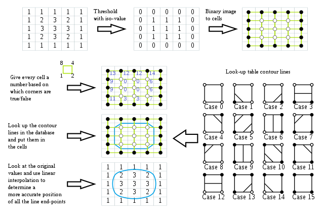
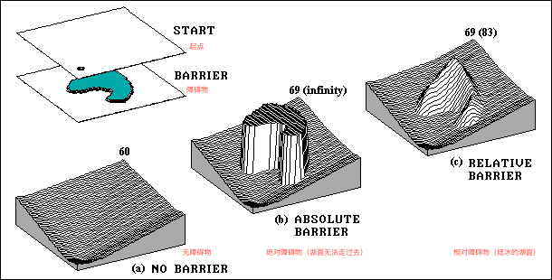

# A Brief Tutorial for Experiment of Spatial Analysis (Raster Part)
> - Pan 6.19 `14:00`
> - 本文主要介绍一下个人对空间分析实习的一些想法，**水平有限**。若有错误，欢迎批评指正。
> - 在 `GitHub`上修改 [本文档](https://github.com/pzq123456/RVGeo/tree/main/docs) 。拉取、提交 `Pull Request` 即可。本教程不定期更新，若要获取最新版本也请读者访问上述链接。
> - 以下 JavaScript 简称 JS ， 该语言易于理解，可以很容易地转换成其他语言的代码。若读者对 JS 不了解可以参考 MDN 的 [这篇教程](https://developer.mozilla.org/zh-CN/docs/Web/JavaScript)
> - 若觉得本教程有用，欢迎为这个仓库点赞。

个人精力有限，本教程不会涉及 **矢量相关算法、分型、正态云** 部分的算法。另外，本教程内的算法思路仅代表个人观点，会给出一些与解题相关的链接，烦请读者自行阅读理解。


> `Joke` : 当你正真开始写代码的时候，你会发现困扰你的其实只有两个问题：
> - 这个变量该叫什么？
> - 这段功能该放在哪个文件夹下？
 

- 本教程的主要内容及更新计划：（同时也是 RVGeo 的更新计划）
  - 第一阶段（栅格 DEM 部分算法）：累积表面的生成、栅格等值线生成、基于累积表面的简单应用、栅格水流模拟部分算法、DEM 地形分析部分算法、基于栅格的物理仿真
  - 第二阶段（图论及最短路径部分算法）：略
  - 第三阶段（聚类算法及地图统计分析部分算法）：略

> 其中，第一阶段是正式开始编写的算法。二、三阶段算法会逐步整理及实现。

## [算法自查表](/docs/README.md)

## 项目结构方面的建议
具体算法可以首先整合到一个单独的核心算法包（库）中，交互式界面可以在此基础之上构建。在包的编写过程中，注意将相似功能的代码放到一个文件（文件夹）下，并整理好接口以方便调用。例如：
```
/YourApp             |      /你的项目
    /core            |          /核心算法库
        /Index       |              /接口
        /Base        |              /基础类
        /Vector      |              /矢量
        /Raster      |              /栅格
        /Utils       |              /通用工具
        /Renderer    |              /渲染
    /UI              |          /用户交互界面
        /Canvas      |              /画板
        /Brushes     |              /画刷
        /Actions     |              /对话框
        /Utils       |              /通用工具
    /Docs            |          /文档
    /Others          |          /其他
```
> 建议在开始写本次实习的代码之前，先将去年的代码整理一下，按照一定的逻辑组织起来。

- `Core/Base/` :
核心算法包中，可以首先编写底层的类（点线等），并将一些常用的算法写进去（计算距离、求交等）。这样，我们后续的算法实现就有了基础的对象。交互式绘制和分析时，我们本质上就是在**操作这些对象并不断触发渲染**。这样设计还有一个好处，我们可以依照这些基础类的属性值设计对对应的数据库表，为后续的功能拓展做准备。例如，画板内容的持久化存储，我们在绘制完后可以导出文件，下一次就只需要读取该文件并初始化有关的类。
> 建议将数据和具体的显示（渲染）分开，几何数据和统计数据分开。
-  `Core/Renderer/` : 
该类负责将我们的数据画出来，在浏览器中就是调用 2D Canvas 的 Context 接口。可以以类为单位封装，这样只需要几行代码就可以渲染。比如说：
> 以下代码仅仅介绍思路，不可以实际运行
```js
// base.js
class MyPointClass{
    // ...
}

// renderer.js
class brush{
    // 如果不想每次都输入ctx 可以在初始化里就注册 ctx
    // 初始化也可以设置画刷的颜色、宽度等
    // ...
    DrawPoint(ctx,point,args){
        // 该方法负责调用  2D Canvas 的 Context 接口将 point 绘制到画板上
    }


    ClaerExtend(ctx,GeometryElemt){
        let rect = GeometryElement.getExtent(); // 该方法返回一个矩形对象
            // 在将数据绘制到画板上之后，在下一次绘制之前需要清空画布，清空一整块画布其实有些浪费

        ctx.Clear(rect);// 我们可以只清空对应图形的外包络矩形区域
    }
}

// 我们已经有了一个点的列表
let p1 = new MyPointClass(0,0);
let p2 = new MyPointClass(0,0);
let p3 = new MyPointClass(0,0);
const Arr = [p1,p2,p3];

// 渲染这个点集就可以
for(let i = 0; i < 3; i++){
    brush.DrawPoint(ctx,Arr[i])
}
```

## 一些栅格算法的思路（ 基于 DEM ）
> - 矢量部分、分型部分以及正态云部分的算法相对好实现，去年很多小组都已经实现的很好了，这里就不再赘述。当然，也可以参考我们的代码及文档（不全）。限于个人时间及精力，我无法一一整理。

相较于矢量方向，栅格方向的算法实现起来会稍微复杂一些。并且，这一块的资料非常稀少，老师提供的课件也是英文的，我想这一块是值得仔细探究的。我在这里列出一些我个人的想法，希望能够给大家一些启发。

### 栅格数据的等高线生成
> 参考代码： [V_get_Contour](https://github.com/pzq123456/RVGeo/blob/2dc5aa33817d74bfcd4be5683550d4caa5cbd8d5/src/grid.js#L343)
> - 参考定义：https://en.wikipedia.org/wiki/Marching_squares 
> - 该部分代码仍存在一定的问题（无法应用到复杂栅格，等高线开闭异常）
- 要点
  - 这是一个结合了
    - 栅格数据（源数据）
    - 矢量数据（等高线，目标数据）
    - 为了划分等高线值范围还需要获取栅格值的统计数据（最大最小值）
    - 为了显示效果还需要进行线抽稀（道格拉斯扑克法）
  - 首先需要获取栅格在画布中的位置（MBR），然后在此基础之上计算每个栅格的中心点
- 思路1（废弃）
  - 首先对对栅格进行分类，将连续的符合要求的栅格放在一个集合中
  - 然后获取每个集合的边界
  - 将这些边界点按照时针方向排序
  - 并根据起止点之间的距离判断是否闭合该段等高线
  - 最后将边界点集转换为点集
- 思路2（目前采用该方法实现，但是对于正负地形的处理仍存在问题，无法处理复杂情况）
  - > 注： 
  - > - 该方法虽然效果不好，但是思路比较直接，对于编程联系还是有一定的帮助的
  - > - 该算法与 marching squares 的第一步极其相似，可以说本质上还是相通的。
  - 
  - 也可以采用淹没模拟的方法
  - 从最小的值开始，逐层提取被淹没区域的边界线

#### 正解 (marching squares) 方法:
> - In computer graphics, [marching squares](https://en.wikipedia.org/wiki/Marching_squares) is an algorithm that generates contours for a two-dimensional scalar field (rectangular array of individual numerical values). A similar method can be used to contour 2D triangle meshes.


- 算法步骤
  - 对栅格数据进行阈值处理，将其转换为二值图像（也就是“淹没”操作）：
    - 1 代表高于阈值的区域
    - 0 代表低于阈值的区域

每一个 2x2 的像素块组成一个等高线单元，所以整个图像由这些单元格组成（如下图中绿色部分所示）。注意，这个等高线网格在每个方向上都比原始的 2D 场小一个单元格。

- 对于每个等高线单元格：

  - 在每个单元格的角落组成 4 位二进制索引：按顺时针方向绕单元格走，将位附加到索引上，使用按位或和左移，从最左边的最高有效位到最左边的最低有效位。
  - 生成的 4 位索引可以在 0-15 范围内有 16 个可能的值。

 Marching squares algorithm 算法简图

> - 该算法使用了两个栅格，等高线栅格比原栅格小一圈刚好可以避免边界问题（例如上一种方法会够不到边界）
> - 并且该算法从单个栅格的角度考虑问题，可以很容易实现并行计算提高效率
> - 该算法实现难度较大，暂时没有实现。我会参照该算法的思路进一步优化思路二的代码。

### 累积表面 (Accumulation Surfaces)
> 参考链接： 
> - [GeoWorld, December 1997, pg. 28](http://www.innovativegis.com/basis/MapAnalysis/Topic5/Topic5.htm)



> 插图:
> - 注意图中的数字： 平地上至最远处的距离（穿过湖面的距离）
> - 一个栅格单位代表 100 米，以下数字若不加单位都代表 栅格单位 。
> - a. 是从单个点出发形成的累积表面的三维视图。曲面上的最低点值为 0，表示它距离起点 “0 栅格单位”。最远的位置位于右上角，距离为:
>   - 60 个网格 * 100 米/网格 = 6000 米
> - b. 将绝对障碍定为无限远。它将最远的可到达位置处的栅格值设为 69 ，表示由于绕湖而行使得距离远了 900 米。
> - c. 假设人在冰上走得慢 5 倍。绕湖一周，它仍然距离对面的角落6900米。然而，如果你小心翼翼地跋涉到湖心，就相当于在开阔的土地上跋涉8300米。

#### 累积表面生成 (“splash” algorithm)
> 代码实现参考： [splash_AccmulationSerface](https://github.com/pzq123456/RVGeo/blob/f3e97611b77540aa5cbe282eb7c947f3f5d0e6cb/src/grid.js#LL272C50-L272C50)
- 要点
    > 注： 参考资料中没有给出累积表面生成的具体算法，只是阐述累积表面的本质及性质。以下内容为原始资料的简略翻译。
  - 累积表面是一种类似于 DEM 的模型，某一处栅格内存储的值是到（系列）起始点的（最短）直线距离。参考资料中提到，我们可以模仿涟漪的扩散去生成累积表面。具体到栅格 GIS 中，我们假定波的宽度是一个栅格，而与圆形涟漪的等价物就是同时向八个方向传播。
  - 当然，起始点也可以是多个。当两个涟漪的波前相遇时，波的传播停止，并在接触点处记录距各自起点相同距离的距离值。不规则连续物体也可以按上述方法生成累积表面。上述操作的最终结果是，处处都存储着距最近起始点距离的栅格（原文中是 map ，意指映射或函数，输入为栅格行列号，输出为距最近起始点距离）。
  - 八个方向，每一步的距离都是相等的。因此，累积表面揭示了每一个栅格位置的优化方向。

- 思路
    ```mermaid
    graph TD
    A[起始点] --> B[将起始点放入队列]
    B --> C[当队列不为空时]
    C --> D[取出队列中的一个点]
    D --> E[对这个点的八个方向进行判断]
    E --> F{是否越界}
    F --> |是| G[跳过]
    F --> |否| H{是否已经访问过}
    H --> |是| I[跳过]
    H --> |否| J[标记为已访问]
    J --> K[计算距离]
    K --> L{是否是障碍物}
    L --> |是| M[跳过]
    L --> |否| N[更新距离]
    N --> O[将这个点放入队列]
    O --> C
    C --> P[返回累积表面]
    ```

  - 现在我们只考虑单一点的累积表面生成问题。这是典型的广度优先遍历，可以使用递归方法，也可以选择借助于队列来实现（本质上一样）。
  - 具体实现可以参考力扣上的这道题：[733. 图像渲染](https://leetcode.cn/problems/flood-fill/) 只不过它是四个方向。
  - 借助于队列的广度优先遍历的思路：
    ```
        我们设置一个队列，先把初始点添加进去
        规定每次从队列取出一个坐标
        对这个坐标染色，并且把这个坐标的邻居（符合要求且不重复的好邻居），放到队列中
        当这个队列为空的时候，说明染色完成
    ```
    因为队列每次取出的是最后的，而每次添加的是放在最前面，所以可以想象到，每次先处理的都是层级最少的，最接近初始点的，然后慢慢扩大，这样就实现了 广度优先搜索

- 一些说明：
  - 原始资料中认为仅仅使用八连通域就可以生成累积表面（其实这只能生成同心正方形），但是实际想要实现类似涟漪的扩散效果需要进行圆的光栅化过程，我们这里简化了，仅使用一个八边形连通域来加速计算。
  - 并且多点累积表面及连续起点的累积表面生成需要进一步设计（暂未实现）

> - 在 JS 中实现栈及队列的方式：JS 中的这两种数据结构都可以使用 Array 来实现。
>   ```js
>   
>   var stack = []; // 栈
>   stack.push(2); // stack is now [2]
>   stack.push(5); // stack is now [2, 5]
>   var i = stack.pop(); // stack is now [2]
>   alert(i); // displays 5
>   
>   var queue = []; // 队列
>   queue.push(2); // queue is now [2]
>   queue.push(5); // queue is now [2, 5]
>   var i = queue.shift(); // queue is now [5]
>   alert(i); // displays 2
>   
>   ```
> - JS 中的无穷大 [Infinity](https://developer.mozilla.org/zh-CN/docs/Web/JavaScript/Reference/Global_Objects/Infinity) ， 这是一个全局变量，是 JS 中允许的最大整数，它的倒数就是 0 。
>   ```js
>   const maxNumber = Math.pow(10, 1000); // Max positive number
>   if (maxNumber === Infinity) {
>     console.log('Let\'s call it Infinity!');
>     // Expected output: "Let's call it Infinity!"
>   }
>   console.log(1 / maxNumber);
>   // Expected output: 0
>   ```


#### 累积表面的应用
> https://www.youtube.com/watch?v=_KlRRowXv7k

### DEM 表面积
> - https://leetcode.cn/problems/surface-area-of-3d-shapes/
> - 该算法包括底面积及侧面积。实际计算时需要去除底面积。

参照上述题目，我们可以通过计算正方体的表面积来近似得计算 DEM 的表面积。

## 聚类算法
> - 该部分算法位于 `learn.js` 文件中，方便起见我简单编写了多维向量类。

### K均值聚类
> - K均值聚类已经实现，参考 `learn.js` 第 `158` 行， 使用方法见 `main.js` 第 `297`行

1. 从样本中选择 K 个点作为初始质心（完全随机）
2. 计算每个样本到各个质心的距离，将样本划分到距离最近的质心所对应的簇中
3. 计算每个簇内所有样本的均值，并使用该均值更新簇的质心
4. 重复步骤 2 与 3 ，直到达到以下条件之一：
    - 质心的位置变化小于指定的阈值（默认为 0.0001）;
    - 达到最大迭代次数


### 迭代自组织聚类算法 (ISODATA) [2]
- 思路
1. 选择某些初始值。可选不同的参数指标，也可在迭代过程中人为修改，以将N个模式样本按指标分配到各个聚类中心中去。 
2. 计算各类中诸样本的距离指标函数。
3. 按给定的要求，将前一次获得的聚类集进行分裂和合并处理
   1. 分裂处理
   2. 合并处理
4. 重新进行迭代运算，计算各项指标，判断聚类结果是否符合要求。
   - 经过多次迭代后，若结果收敛，则运算结束。
- 空间应用背景下的性能调优[3]
  - To improve the running time, an obvious alternative would be to store the k centers in a spatial index such as a kd-tree.6 


## 物理仿真
- 下一版本将带来基于物理学的风场、流场仿真。目前，该部分会有一个简单的示意 Demo 。

## RVGeo 长期更新计划
> - 本代码库及文档会长期维护，并尽可能服务于教学目的。
- 基础类的重构： 随着代码量的增加，库的复杂性也在上升，因此需要不时重新组织代码片段。
- 统计类基础渲染器与统计信息的解耦合： 为了更好地与现有的 JS 生态融合，统计类不强制要求使用自带的渲染器
- 物理仿真模块：基于重构后的栅格类（也可能是 DEM 类），通过物理仿真模块包装，实现基础的环境方向的物理仿真。也会有一些基于流水物理的地形分析算法放在该类下面。
- 本代码库永远不会涉及：具体界面的搭建。除了必要的数据渲染工具（用于debug）之外，本库不会设计编写用户界面部分的代码。

## Reference
- [1] [Marching squares. (2022, October 6). In Wikipedia.](https://en.wikipedia.org/wiki/Marching_squares) https://en.wikipedia.org/wiki/Marching_squares
- [2] [ISODATA](https://zhuanlan.zhihu.com/p/403365978) https://zhuanlan.zhihu.com/p/403365978
- [3] [A FAST IMPLEMENTATION OF THE ISODATA CLUSTERING ALGORITHM](https://www.cs.umd.edu/users/mount/Papers/ijcga07-isodata.pdf) https://www.cs.umd.edu/users/mount/Papers/ijcga07-isodata.pdf