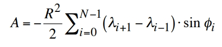

# 项目文档
> - 一些无法自动生成的文档将会放在这里主要包括：
>   - 项目的设计文档（Design）
>   - 具体的使用教学文档（Tutorial）
>   - 数学及其他理论原理的详细讲解（Theory）
- https://geojson.io/

- https://github.com/Turfjs/turf/
- http://turfjs.org/
- https://datatracker.ietf.org/doc/html/rfc7946#section-3.1.4

GeoJSON supports the following geometry types:
   Point, 
   LineString, 
   Polygon, 
   MultiPoint, 
   MultiLineString,
   MultiPolygon,
   GeometryCollection

## 框架重构的一些关键问题
> - 球面多边形面积量测 https://trs.jpl.nasa.gov/handle/2014/40409

1. 最基础的问题之一： 坐标系问题。这个问题可以分为两个方面，一个是坐标系问题一个是投影问题。
    

   1. 坐标系问题？
        坐标系问题是整个系统最底层的问题，即我们该如何表示地球上的点？是将其放在一个（椭）球面上，用经纬度来表示呢？还是转到三维视角下，使用三维坐标来表示这些点？ GeoJSON 规定使用 WGS84 坐标系下的经纬度来表示点。然而，球面三角学的计算必然伴随着较大的性能开销。三维坐标可以使用向量计算来避免繁杂的三角学计算，但是会增加内存的消耗，也会损失一些精度。
   2. 投影问题？
        该问题的核心是如何在二维（纸张）平面上展现球面上的数据，也就是如何绘制平面地图的问题。正是该问题引入了投影的概念。通过投影，我们可以将球面上的点投影到二维平面上，从而实现平面地图的绘制。投影的方式有很多种，每一种投影方式都有其优缺点。
   3. 拓展性与实用性？
        地理信息系统要解决的问题往往受到一些现实条件的制约。无论采用何种方式实现，我们都绕不开关于尺度的权衡问题。一个先进的地理信息系统必然能够根据尺度的不同采用不同的问题解决策略。例如，某一极小的区域内，我们可以将球面坐标退化为平面坐标，通过采取这样的策略，系统在减少计算开销的同时，也能将误差控制在合理的范围内。系统内部必须有一个标准的数据模型，作为拓展模块，我们可以编写一些列灵活的坐标转换函数实现更细致的多尺度处理策略。
    4. 与栅格数据的协作？
        我们希望将栅格数据高效地的引入进来，探索栅格矢量一体化解决方案。相较于二维平面栅格数据渲染，球面渲染会更为复杂。

- https://github.com/Turfjs/turf/blob/master/packages/turf-area/index.ts
- read://https_datatracker.ietf.org/?url=https%3A%2F%2Fdatatracker.ietf.org%2Fdoc%2Fhtml%2Frfc7946%23section-3.1.4
- read://https_tech.meituan.com/?url=https%3A%2F%2Ftech.meituan.com%2F2014%2F09%2F05%2Flucene-distance.html

## 凸包及散点轮廓 Convex hull & Alpha Shapes
> reference: 
> - [Convex hull](https://en.wikipedia.org/wiki/Convex_hull_algorithms)
> - [Alpha Shapes](https://graphics.stanford.edu/courses/cs268-11-spring/handouts/AlphaShapes/as_fisher.pdf)
> - [Graham scan](https://en.wikipedia.org/wiki/Graham_scan)
> - [Mercator projection](https://en.wikipedia.org/wiki/Mercator_projection)
> - [turf projection](https://github.com/Turfjs/turf/blob/master/packages/turf-projection/index.ts)

Every Alpha Shape is a convex hull, but not every convex hull is an alpha shape. 