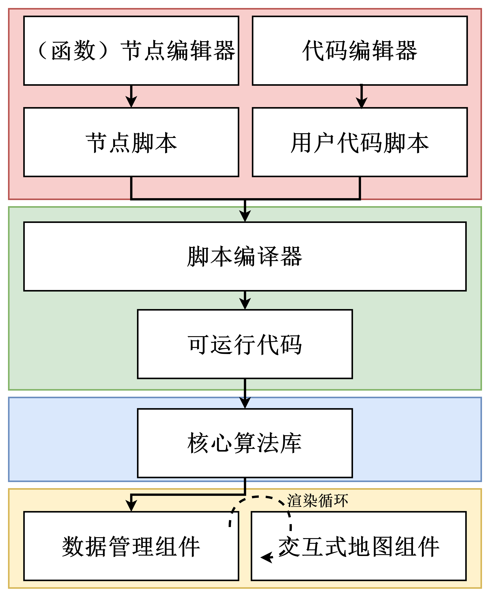
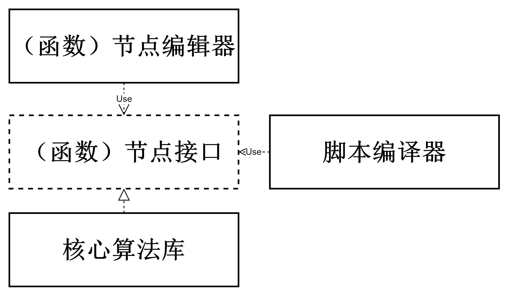
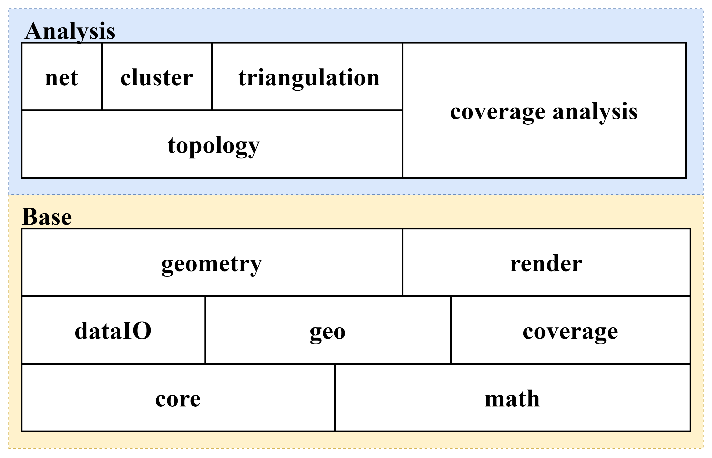
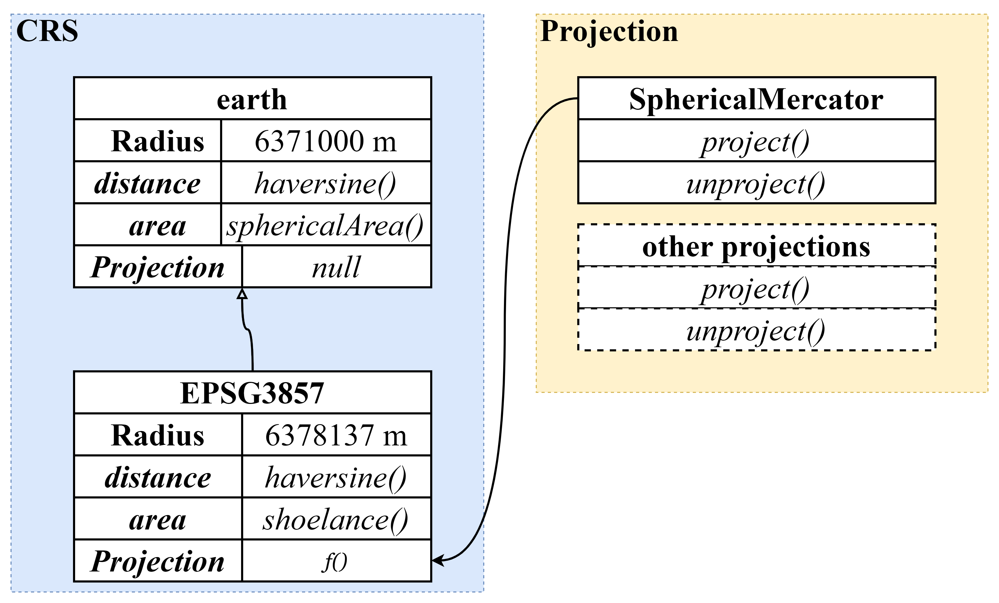
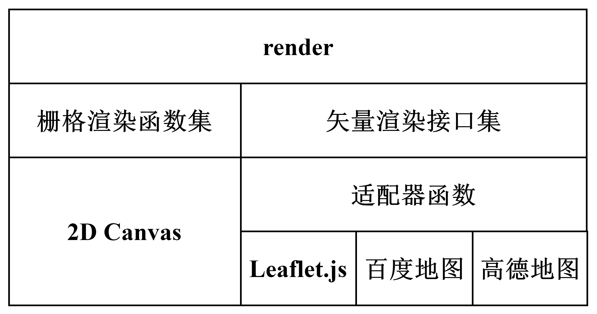
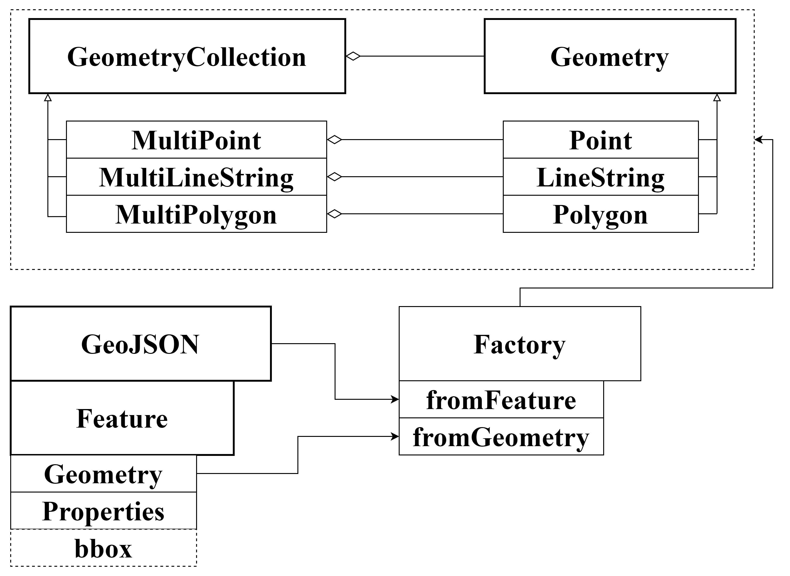
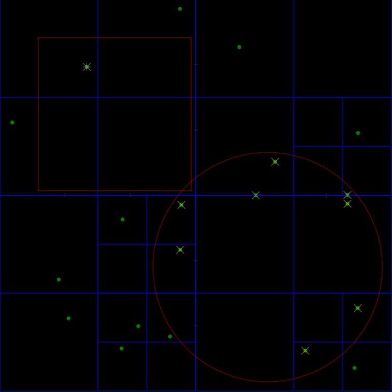
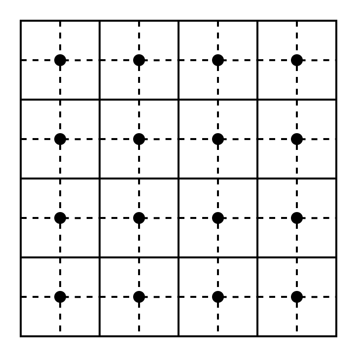

# RVGeo: A Modern Web Mapping System for Geospatial Data Analysis
> 本文档所描述的基于浏览器的现代化 GIS 技术体系尚未完成。RVGeo 仅仅是一个核心包，用于支撑地理信息系统核心功能的模块。

## 0. 项目总体结构安排


本项目由脚本编辑模块（包括节点编辑器、代码编辑器）、脚本编译及执行模块、核心算法模块、可视化与交互模块组成。用户不仅可以使用代码编辑器来直接编写函数式数据分析处理脚本，还可以使用节点编辑器进行交互式低代码脚本编辑。用户脚本建模为混合了数据流和控制流的有向无环图（Directed Acyclic Graph）。脚本编译器接受用户脚本，解析并转换为浏览器可直接执行的代码，执行代码返回结果或报错信息。数据管理组件维护一个惰性渲染循环，当地图中需要显示的数据发生变更，则触发地图显示更新。同样的，用户与地图的交互也会导致数据变更，此时会逆向触发导致代码重新执行以更新结果数据。



节点编辑器会提供系列具有特定数据格式的输入输出节点，这些节点本质上是一组用于描述特定数据转换能力的接口，脚本编译器参照接口名，根据设计好的策略将节点图转换为可以直接运行的代码。

### 1. 核心算法库模块结构


本项目的核心是一套使用 TypeScript 语言开发的、独立于用户界面的核心算法库。在基础之上，本项目合理利用现代浏览器技术开发出界面，实现各种基础功能及高级分析功能。

算法库本身由众多具模块组成，这些模块又可以根据依赖关系划分出不同的层级，下图是粗略的模块示意图，纵向上存在依赖关系。算法库可以分为基础与分析两个部分：

  - 核心模块（core）：用于实现事件系统、类集成系统等与具体算法无关但与项目设计模式的实现高度相关的核心代码，是整个代码库的核心。
  - 数学模块（math）：该模块专注于纯数学场景下的算法，实现了一套空间矢量计算函数集、单位球球面量测函数集及复数计算（用于傅立叶分析）函数集以及单位换算函数集。可以通过联合本模块与地理模块实现地球表面的量测，得益于这样的低耦合设计，用户甚至可以十分方便地实现其他非地星球的量测函数集。
  - 数据交换模块（dataIO）：该模块负责数据解析、数据格式转换、内部对象生产等功能。目前支持 GeoJSON 文件、TopoJSON 文件读取与输出。通过实现对应的接口，用户也可以根据需要使用其他算法包来拓展该模块的功能。
  - 地理模块（geo）：
  
  该模块由地理坐标系子模块（CRS）与投影子模块（Projection）组成。地理坐标系子模块提供不同坐标系下的投影转换函数、距离及面积计算函数，earth 基类为半径为 6371000 米的正球体。投影子模块具体实现正逆向投影函数，可按需拓展。

  - 栅格数据模块（coverage）：该模块维护一个用于表示多波段遥感影像数据的三维数组、一个用于记录对应波段栅格统计值的缓存字典以及一个基于四叉树的（可选择性构建）影像金字塔。栅格统计值缓存字典采用“惰性求值，动态更新”的设计思路，只用户调用栅格类提供的统计函数时才会开始计算并缓存对应波段的统计值，一旦缓存字典内存在统计值该类就会细粒度动态维护该统计值。
  - 地理矢量几何体模块（geometry）：参考 GeoJSON 最新标准，实现 GeoJSON 对象的读取、修改与输出。该模块用于描述用户可以操纵的地理几何对象，是地理信息系统交互、信息交换等功能实现的核心。该模块通过抽象类、继承及接口机制，在保证代码简洁的同时提供优越的可拓展性。
  - 渲染模块（render）：
    
    该模块分为两个部分，栅格数据渲染函数集及矢量数据渲染接口集。栅格数据的渲染基于浏览器的 Canvas 标签原生实现，不依赖外部库。矢量数据渲染，考虑到灵活性，将对矢量数据的渲染能力抽象为系列接口。
  - 分析部分（Analysis）：该部分对矢量数据构建拓扑并在此基础上实现网络分析、聚类分析和三角网构建。另外，该部分还针对栅格数据实现了系列分析功能。

### 2. 基础算法设计
1. 内部地理几何体对象类


根据 GeoJSON 标准，geometry 模块抽象出 Geommetry 及 GeometryCollection 两个基类，前者派生出 Point、Lingstring 及 Polygon 子类，后者派生出 MultiPoint、MultiLinestring 及 MultiPolygon 子类。GeometryCollection 及其子类均由 Geommetry 的子类聚合而成。上文提及的每一个类均有对应的工厂函数，工厂函数接受 GeoJSON 对象或 GeoJSON 对象的 Geometry 属性对象，按照一定规则生产内部地理几何体对象，对于复杂嵌套的 GeometryCollection 及 FeatureCollection 则会递归调用工厂函数，完成对象解析与初始化工作。

2. 坐标转换与量测算法

参照公式（1.2 章节的公式编号），本项目实现了球面墨卡托的正逆向投影函数。考虑到地球是一个球体，而我们已经有了在球面坐标系与平面坐标系之间转换的投影函数，量测算法的实现就有两个基本方向：1）直接在球面计算；2）将所有待量测坐标投影至笛卡尔平面再使用平面几何计算；本项目在数学模块中实现了以下函数：

- 量测球面上两点间距离可以使用 haversine 公式：
  $$ a = \sin^2(\frac{\Delta\phi}{2}) + \cos(\phi_1) \cos(\phi_2) \sin^2(\frac{\Delta\lambda}{2}) $$
  $$ c = 2 \cdot \arctan2(\sqrt{a}, \sqrt{1-a}) $$
  $$ d = R \cdot c $$
  - 其中 $R$ 为地球半径，$\phi$ 为纬度，$\lambda$ 为经度。

- 量测球面上两点间面积可以使用球面三角形面积公式：
  $$ A = R^2 \cdot (\alpha + \sin(\alpha) \cdot \cos(\beta) - \beta) $$
  - 其中 $\alpha$ 为两点间的弧长，$\beta$ 为两点间的角度。

也可以经纬度坐标投影至平面后，再使用平面几何计算。

- 量测平面上多边形面积可以使用 Shoelace 公式：
  $$ A = \frac{1}{2} \left| \sum_{i=0}^{n-1} (x_i y_{i+1} - x_{i+1} y_i) \right| $$
  - 其中 $n$ 为多边形顶点数，$(x_i, y_i)$ 为多边形顶点坐标。


## 1. Why RVGeo?
本课题计划针对现代浏览器的诸多技术特性，使用 TypeScript 语言设计并实现一系列用于支撑地理信息系统核心功能的模块，这些核心模块可以快速构建地理信息系统的基础功能，包括基于 GeoJSON 标准的地理信息存取、地图显示、地理要素编辑、（简易）空间分析等。同时，本课题还计划设计并实现一个在线代码编辑器，用于支持用户在浏览器中编写、调试和运行地理数据分析处理脚本。本课题的研究目的和意义主要包括以下几个方面：

- 依托现代浏览器的诸多技术特性，开发与之相适应的地理信息系统核心功能模块，并研究一种异于桌面端地理信息系统的技术路线。
- 研究使用 TypeScript 语言实现地理信息系统的核心算法，如地理要素的投影、空间索引、空间分析等。在编码实践中，把控项目质量，使用单元测试、版本管理、持续集成等现代软件开发工具和方法，提高代码质量和开发效率。注重文档编写，搭建相应的文档网站，以便于用户和开发者使用和参与开发。
- 研究现有涉及地理信息的优秀开源项目（如 Turf.js、Leaflet、OpenLayers 等），学习其设计思路和实现方法，总结业界实践经验与默认标准。
- 面向专业用户，开发出一款好用的在线代码编辑器。用户基于上述基础设施，可以编写更为专业复杂的业务脚本，提高系统的易用性。

## 2. Research Content
- 研究现代浏览器的技术特性、已有的基于浏览器的典型地理信息应用及相关开源项目，总结发展现状，学习行业标准。
- 使用 TypeScript 语言开发系列用于支撑地理信息系统核心功能的基础模块，主要包括：
  - 核心模块：用于实现事件系统、类集成系统等与具体算法无关但与项目设计模式的实现高度相关的核心代码，是整个代码库的核心。
  - 数据结构模块：用于实现四叉树（面向点、面向栅格数据的）及其他一些必要的数据结构
  - 地理模块：该模块实现处理坐标系的系列功能，该模块包含两方面内容，坐标系及投影。目前主要实现的是 EPSG:3857 坐标系，该坐标系使用球形墨卡托投影将 EPSG:4326 也就是 WGS84 坐标系下的经纬度坐标投影到平面上。该模块设计时参考了 LeafLet 的实现，使用对象组合技术在保持代码简洁的同时提供较好的灵活性。用户可以基于基础类实现自己的投影及坐标系。
  - GeoJSON 地理几何体模块：参考 GeoJSON 最新标准，实现 GeoJSON 对象的读取、修改与输出。该模块用于描述用户可以操纵的地理几何对象，是地理信息系统交互、信息交换等功能实现的核心。该模块通过抽象类、继承及接口机制，在保证代码简洁的同时提供优越的可拓展性。
  - 数学模块：该模块专注于纯数学场景下的算法，实现了一套空间矢量计算函数集、单位球球面量测函数集及复数计算（用于傅立叶分析）函数集以及单位换算函数集。可以通过联合本模块与地理模块实现地球表面的量测，得益于这样的低耦合设计，用户甚至可以十分方便地实现其他非地星球的量测函数集。
  - 拓扑模块：主要用于实现基础的空间拓扑计算，譬如线段求交、多边形求交等。
  - 空间分析模块：该模块是一个相对复杂的模块，在复用上述基础代码的同时，实现面向矢量数据、栅格数据、网络数据的空间分析算法。该模块可以视为一个可拓展算法的工具箱。
  - 渲染模块：该模块主要负责数据渲染，会根据渲染方式分为若干部分。在开发阶段会首先实现基于 Canvas 的二维渲染模块，在后续集成阶段会使用更加成熟的地图框架（如 LeafLet）。
  - 交互控制模块：提供基础的交互功能，以透明图层的方式捕捉用户操作。
- 结合已有的地理信息基础模块，开发在线代码编辑器及拖放交互式低代码脚本生成器
  - 代码编辑器拟采用微软公司的开源代码编辑器 Monaco Editor ，该编辑器采用 TypeScript 语言编写，支持代码高亮及智能提示，可直接嵌入到浏览器中。并且，该代码编辑器对 TypeScript 的智能提示有很好的支持，只需要导入对应项目的 *.d.ts 声明文件即可获得优秀的智能提示。同时，结合 TypeScript 的静态检查类型技术，用户可以轻松写出高质量代码。
  - 使用前端技术搭建拖放交互式低代码脚本生成器：拟采用数据流节点图的模式，具体样例可以参考 Blender 软件中的节点编辑器。
    - 首先需要定义抽象的节点基类，再再此之上拓展出数据源、数据流、输出数据、及其他各种节点。
    - 再设计实现树状数据流数据结构，用以描述数据的流动方向及对各种方法的调用关系。该部分的设计可以参考抽象语法树，一种常见于编译器中的数据结构，主要用于对纯文本编程字节流进行符合编程语言语意规则的解析与标注。附带的，还应当实现脚本生成器，将抽象的数据流生成为可以直接运行的程序。我们将数据流图转换为可运行程序的过程称为“数据流图的前向编译”，与之对应的还会有将程序还原为节点图的“反向编译”，但是考虑到实现的难度（需要对 TypeScript 或其他编程语言进行抽象语法树的获取及简化）暂不实现。
    - 最后考虑渲染与交互。拟采用 Canvas 标签作为响应式绘制底图，在上使用其他 HTML 标签显示节点信息。该部分视项目进度酌情使用开源框架。
- 整合与集成：
  - 将上述所有内容集成到一个网站中，用户可以查阅代码文档、查看源代码、自行编写地理信息处理脚本等，最终实现一个功能丰富的基于浏览器的地理信息系统技术社区。
- 杂项：
  - 数据源：瓦片底图将从 OpenStreetMap 租住获取，矢量示例数据将从其他开源数据网站中获取。
  - GeoTIFF数据：该数据的解析使用 GDAL 库，对于其他使用到的开源软件都会在文章末尾予以说明。

## 3. Technical Notes

### 1. Google Earth Engine : A Multi-Scale Geospatial Data Analysis Platform for Everyone
- 背景：随着超级计算机及高性能计算系统资源日益丰富，云计算服务的商品化也变得越来与普遍。与此同时，免费的多尺度遥感数据资源也随着世界范围内的政府机构数据开放，变得越来越丰富。然而，想要充分利用这些已有的资源，却需要相当可观的技术投入。这需要一个庞大的信息系统来统筹数据库管理、计算资源分配、网络管理以及众多地理数据处理框架适配。
- 本质及功能：谷歌地球引擎是一个高性能计算云端平台，集成了大量空间数据集及空间数据处理框架。这使得用户一定程度上摆脱了硬件及数据短缺的困扰。并且，用户还可以轻易共享基于谷歌地球引擎的算法。地球引擎本质上是一个支持高效处理 PB 级别的数据并行计算设施，它使用网络接口对外提供服务，并且用户可以在一个基于网络的交互式编程环境中快速构建算法原型并查看运行结果。谷歌地球引擎收录了众多公开地理数据集主要包括：众多遥感卫星及航空摄影系统的多波段遥感信息、气象参数、土地覆盖类型数据等。所有的这些数据都已经过预处理，可以在地球引擎内直接使用。
- 数据结构：谷歌地球引擎基于常见的多波段二维网格遥感数据设计了轻量化的影像数据容器类（类名为 image ）。在该容器类内，任意波段的二维格网数据都必须有相同的数据类型、分辨率以及投影。同时，该容器还需要支持键值对类型的元数据格式，如位置、数据集发布时间、预处理信息等。所有相互关联的影像（譬如同一传感器所生产的影像数据）构成影像集合类（类名为 collection）。影像集合类可以快速对相关数据进行检索，譬如用户可以按照时间及云量参数对 Landset 7 的传感器数据进行检索。
- 数据预处理：地球引擎会将原始数据直接裁剪为 256 * 256 的格网数据，有别于传统的“数据立方体”系统，地球引擎不会对数据进行重采样而是保留原有的投影、分辨率及比特深度。为了在用户进行在线脚本编写时，快速显示影像数据，系统需要提前构建多分辨率尺度的影像金字塔，该影像金字塔是在原始数据的基础上以二为底数进行降采样得到。（对于离散值，如分类标签数据等，系统会使用最小、模式、最大或固定采样之一进行采样。）这样加载了低分辨率的区域图像用于快速显示的同时，更高精度金字塔层级的影像数据也就得以被筛选并合理加载出来。
- 系统架构：谷歌地球引擎代码编辑器及其他基于此的第三方应用都是通过一个客户端软件包（由 JavaScript 或 Python 编写）与后台的 REST API 进行交互的。即时请求会首先被服务端前台处理，同时繁琐的子查询会由前台递交计算管理设施并分配到服务器池中。批处理系统也采用同样的数据处理规则，只不过是采用 FlumeJava 来管理任务分发。FlumeJava 是一个用于支撑开发并行数据处理管线的系统，使用 Java 语言编写。该系统针对并行计算所需的操作抽象出少量算子，并将这些算子进一步抽象为几个核心类。谷歌地球引擎提供超过 800 个函数，大致包括：纯数学运算操作、强大的地理统计操作、机器学习以及影像处理等。用户可以将这些函数组合成自己想要的查询语句，并借助于平台的可视化、数据打印导出等功能来评估结果。
- 计算功能：针对遥感影像，系统提供逐像元、逐波段及波段间的基础代数运算，支持整型、浮点型、数组型、字典型及布尔型等多种数据类型。同时，系统还整合了其他已有的函数库，提供多达20中监督分类、回归算法、非监督分类及用于精度评估的混淆矩阵。用户可以使用上述的功能函数来表达他们想要完成的空间数据计算任务，这种计算任务本质上是一种有向无环图（DAG），图中每一个节点表示一种数据处理函数或数据输入函数（用键值对来表示）。本质上，这是一种纯函数式的编程环境，针对这种特性，谷歌地球引擎也做了许多优化，如透明引用及懒计算等。用户使用兼容客户端语言的客户端程序包提供的函数来编写算法脚本，这样可以大大减少用户的学习成本。本质上，客户端程序包实现了后台众多 REST 接口的代理对象，用户操纵这些代理对象来达成想要的功能。同时，客户端程序包还负责解析用户脚本，生成描述了对应脚本的 DAG 图，并将描述了该 DAG 图的数据结构发送到后端。当然，客户端程序包针对 DAG 图的解析也做了许多优化，譬如合并冗余的节点，直接在客户端完成简单的计算任务（如数值计算，某节点需要计算 3 + 7，在客户端就会直接使用计算结果 10 替换原节点）。
- 懒计算模型：为了实现快速、交互式、可缩放的空间数据分析，谷歌地球引擎使用懒计算模型，即仅加载并计算当前区域的数据。通过检测用户地图缩放等级、投影状况、视窗位置等参数，谷歌地球引擎能动态调整计算的详尽横渡。譬如，某一计算结果所表示的像素点在当前视窗或缩放级别下不可见，则系统会忽略该计算。设计这一套机制的目的是尽可能快地将分析结果呈现给用户，同时尽量减少计算资源的浪费。


### 2. The Bing Map Tile System: A Modern Web Mapping Tile System Architecture
- 概述：微软必应地图（Bing Map）是一款交互式、世界范围的电子地图。该项目为了尽可能快速地响应用户，预渲染了不同缩放层级下的地图并使用瓦片地图系统（Bing Map Tile System）来管理这些预渲染地图。通过研究该系统的架构，我们可以深入了解现代互联网瓦片地图的工作原理，包括地图投影、坐标系系统以及瓦片映射寻址策略等。
- 地图投影：为了确保地图显示的视觉效果，需要一种足够简单高效的地图投影来处理世界范围的地理数据。必应地图采用墨卡托投影，一种简单的保角的圆柱投影。考虑到墨卡托投影极地区的投影会趋向于无穷，所以将最大可投影纬度限制在正负 85.05 以内。同时，为了进一步简化计算，采用球形墨卡托投影的计算公式来计算，这样做会造成Y方向上约0.33%的，几乎肉眼不可见的比例失真。通过上述操作，我们就得到了经典的 Web 墨卡托投影（识别码：EPSG:3857 ，早些时候为 EPSG:900913）数学公式：
  $$ x = R * \frac{\pi}{180} * \lambda $$
  $$ y = R * \frac{\pi}{180} * \ln(\tan(\frac{\pi}{4} + \frac{\phi}{2})) $$
  - 其中 $R$ 为地球半径，$\lambda$ 为经度，$\phi$ 为纬度。
  > - 对于 y 的计算函数，我们可以进一步简化为：
  > $$ y = \frac{R}{2} * \ln(\frac{1+\sin(\phi')}{1-\sin(\phi')}) $$
  > $$ \phi' = \frac{\pi}{180} * \phi  $$

  LeafLet 中的代码实现(y 的计算参照公式二)如下：
  ```ts
  project(latlng: LatLng) : Point {
    const d = Math.PI / 180,
        max = this.MAX_LATITUDE,
        lat = Math.max(Math.min(max, latlng.lat), -max),
        sin = Math.sin(lat * d);

    return new Point(
      this.R * latlng.lng * d,
      this.R * Math.log((1 + sin) / (1 - sin)) / 2);
  }

  unproject(point: Point) : LatLng {
    const d = 180 / Math.PI;

    return new LatLng(
      (2 * Math.atan(Math.exp(point.y / this.R)) - (Math.PI / 2)) * d,
      point.x * d / this.R);
  }
  ```
- 地图缩放比率（Map Scale）及地面分辨率（Ground Resolution）：在渲染地图时，除了需要指定特定的投影方式，还需要指定特定的地图缩放比率。在最低层级（Level 1），所显示世界地图总共只有 512 * 512 个像素。可以使用如下公式来计算对应层级下的地图渲染尺寸（假设一个瓦片的尺寸始终为 256 * 256 像素）：
  $$ width = height = 256 * 2^z $$
  - 其中 $z$ 为地图缩放层级。
  - 单位为像素。
地面分辨率指的是图中一个像素所代表的实际地面距离。例如，地面分辨率 10m/pixel 代表的是地图上每一个像素相当于地面上10米的距离。地面分辨率随着纬度、缩放层级及设定的地球半径而变化需要根据实际情况动态量测。
- 像素坐标系：在确定了投影方式和缩放尺寸后，我们就可以将地理坐标系下表示的事物投影到用于显示和交互的像素坐标系中。在必应地图中，像素坐标系采用与屏幕坐标系同样的规则，即左上角为坐标系原点 (0,0) ，x 轴向右延伸，y 轴向左延伸。计算公式如下：
$$ pixelX = \frac{(\lambda + 180)}{360} * 256 * 2^{\text{level}} $$
$$ pixelY = (0.5 – \frac{\ln((1 + \phi'') / (1 – \phi''))}{4 \pi}) * 256 * 2^{\text{level}} $$
$$ \phi'' = \sin(\frac{\pi}{180} * \phi) $$
- 瓦片坐标及四进制键编码系统（Quadkeys）：为了优化地图瓦片的存取性能，预渲染地图瓦片统一大小为 256 * 256，并且随着缩放级别的增加瓦片数量也呈以二为底数指数递增。对于某一特定级别，世界地图上的每一地图瓦片都有自己的二维（XY）编号，譬如左上角的瓦片为 (0,0) 右下角的瓦片编号为 ($2^{level} - 1$, $2^{level} - 1$ )，根据上述规则，可以很容易由屏幕坐标系下的坐标计算出当前像素所处的地图瓦片编号(除以瓦片尺寸再取整即可)。为了优化构建索引存储地图瓦片所消耗的内存，将二维瓦片编码整合进一维字符串：四进制键编码（Quadkeys），每一个四进制键编码唯一表示了某一特定缩放级别下的地图瓦片，该编码可以用作通用数据库中B树索引的键值。具体操作步骤为：
  1. 二进制表示：将某一地图瓦片的坐标编码（X，Y）分别转化为对应的二进制表示；
  2. 交叉位存储编码：将二进制表示的两个坐标按照由高位到底位，先Y后X交叉为新的二进制结果Key；
  3. 解码：以保留高位零的四进制数编码读取结果Key，转化为字符串；
该编码方式得到的四进制键具有如下特性：
  1. 编码的字符串长度就是当前缩放层级；
  2. 继承性：当前编码字符串的高位对应父地图瓦片的编码；
  3. XY空间中的邻接特征也得以保留：XY坐标相近的四进制键编码也相近；

### 3. GeoJSON Specification
- 术语翻译对照表： 在下表中约定对应英文术语对应的中文术语，

|英文|中文|
|--|--|
|Feature|要素|
|FeatureCollection|要素集|
|Entity|地理实体|
|Geometry|几何对象|
|Properties|属性|

- 概述：GeoJSON 是一个基于 Javascript 对象标记语言（JavaScript Object Notation）的地理数据交换格式。它定义了多种 JSON 对象及用于组合这些对象以表示地理数据的规则包括：要素、属性以及空间位置。 GeoJSON 使用 WGS84 坐标系，坐标使用（浮点数）度来记录。在 GeoJSON 中，要素包含一个几何对象及附加属性。要素集则包含一系列要素。一个 GeoJSON 对象可以表示一个区域、一个组合地理实体或要素集合。支持以下类型：Point, LineString, Polygon, MultiPoint, MultiLineString, MultiPolygon, GeometryCollection

GeoJSON 格式基于 OpenGIS 简单要素实现规范 (SFSQL) 中定义的七种几何类型 [SFSQL]:

- 0 维度：点 (Point) 和 多点 (MultiPoint)
- 1 维度：线 (LineString) 和 多线 (MultiLineString)
- 2 维度：面 (Polygon) 和 多面 (MultiPolygon)
- 以及异构的几何集合 (GeometryCollection)。GeoJSON 中这些几何类型的表示方式类似于该规范中描述的著名二进制 (WKB) 和 文本 (WKT) 表示方式。

GeoJSON 还包含要素 (Feature) 和要素集 (FeatureCollection) 类型。GeoJSON 中的要素对象包含一个具有上述几何类型之一的几何对象和其他成员。要素集对象包含一个要素对象数组。这种结构类似于 Web 功能服务 (WFS) 对“获取要素”请求的响应 (在 [WFSv1] 中指定) 或用于放置点的 Keyhole Markup Language (KML) 文件夹 [KMLv2.2]。WFS 规范的一些实现也为“获取要素”请求提供 GeoJSON 格式的响应，但 GeoJSON 格式规范本身并不包含特定的服务模型或要素类型本体。自 2008 年首次发布以来 [GJ2008]，GeoJSON 格式规范的流行度稳步增长。它广泛用于 JavaScript 网络地图库、基于 JSON 的文档数据库和网络 API。

出于互操作性的考量，最新版本的 GeoJSON 规范已经将替换坐标系的选项删除，GeoJSON 中存储的坐标只能是 WGS84 坐标系下的坐标。

### 4. GIS Vector Data Model and Storage Specification
地理数据矢量数据模型与存储规范中的矢量数据模型
矢量数据模型包括核心数据和扩展数据。核心数据包括空间参照系、要素类和要素，扩展数据包括元数据、组合要素、注记和符号。与 GeoJSON 相类似，该标准也是将几何信息、属性信息等组合在要素对象中。其中，具体的几何类型有36种，相较于 GeoJSON 的其中几何类型主要多出了曲线及由曲线构成的几何图形。在该规范中，要素的几何信息与空间参照系关联，要素的属性信息可自行拓展，要素之间可组合成新的要素。对于空间参照系需要提供提供：空间参照系名称、唯一标识符、该定义的组织机构名称、WKT 表示以及（可选）描述信息。该标准在附录中汇总了几种可用的参照系及其 WKT 表示：1984世界大地坐标系、2000国家大地坐标系、1980西安高斯-克吕格投影坐标系、1954北京高斯-克吕格投影坐标系。可以看到，相较于 GeoJSON 标准，该标准允许使用不同的坐标系来定义地理数据，这也就意味着实现该标准的软件必须提供坐标系转换接口，否则将无法处理多种不同坐标系下数据混合出现的情况。


## 4. Algorithm



### 1. 栅格路径规划算法设计
路径规划算法一般针对图（由节点和弧段组成）所表示的路网数据进行（单源、多源）最小代价路径生成。求解最短路径的算法对于处理栅格数据也十分有用，例如我们可以根据地形数据计算水流路径等。如果我们将栅格数据视作一种特殊的图，则可以复用针对一般节点图的路径规划算法来处理栅格数据。栅格数据可以根据需要转化为每个节点都是四连通的图，同样的，某一栅格与其邻接栅格连通的权值可以根据某一规则由已有的栅格值计算出来。



对于一般的图表示的路网数据，我们至少有两点认识：1）距离：从图中一个节点到另一个节点的代价，代价越大距离越远。2）方向：从起点指向终点的向量可作为路径取舍的度量指标。对于栅格数据，我们还可以根据其特性做出特别的优化，比如在栅格中的代价可以使用经过的栅格数来表达，这样就可以避免使用高复杂度的代价计算函数。

由简单到复杂的路径规划算法可以大致分为三个种类：1）广度优先搜索(Breadth First Search)：在所有方向上均匀遍历数据，碰到障碍物后再躲避。2）全局代价查询(Uniform Cost Search)：该算法会选择使得整体代价最小的路径（例如 Dijkstra 算法），提前规避障碍物。3）启发式算法：例如 A* 算法，该算法是针对某一特定的方向使用启发式函数优化的 Dijkstra 算法，极端情况下会退化为 Dijkstra 算法。该算法会综合考虑障碍物的分布、终点方位等因素。

### 2. 广度优先搜索(Breadth First Search)
该算法追踪一个不断扩大的边界节点队列，对于栅格而言该过程也可以叫做漫水填充(flood fill)。该过程可以使用如下伪代码表达：

**函数：** BFS(graph, start)
**输入：**
* graph: 由节点和边组成的图
* start: 起始节点
**输出：**
* reached: 所有可达节点的集合

**步骤：**
  1. 初始化队列 `frontier` 和集合 `reached`
  2. 将 `start` 加入 `frontier` 和 `reached`
  3. 循环执行以下步骤，直到 `frontier` 为空：
      * 从 `frontier` 中取出一个节点 `current`
      * 遍历 `current` 的所有邻居 `next`
          * 如果 `next` 不在 `reached` 中：
              * 将 `next` 加入 `frontier` 和 `reached`
              * （可选择的某种操作）

对于栅格数据，使用该过程可以构造向量场（将当前栅格与下一个访问到的栅格以键值对的方式存储），也可以构造距离场栅格（根据访问顺序累加栅格值），后续可以根据这些中间结果计算最短路径。对于终点已经确定的情况，我们可以再遇到终点时就推出搜索以减少计算。该过程对于一般的节点图路网也是有效的。另外，该过程并为考虑加权的情况，仅将经过的栅格数对应为距离（代价）。

### 3. 全局代价查询(Uniform Cost Search)
对于一般的节点图路网数据，我们可以赋予边权值，例如路况复杂的边可能要耗费更多的代价。对于栅格数据，也可以根据栅格值来为栅格间的连接边定权，例如，对于数字高程模型，连通极高值或极低值栅格的连接边权值会更大，对应了现实中翻山越岭会付出更高代价。优化全局代价是 Dijkstra 算法的核心思想，在广度优先搜索的过程中计算距离场，择优记录路径即可实现该算法。

```js
function Astar(graph, start, goal):
    frontier ← PriorityQueue()
    frontier.put(start, 0)
    cameFrom ← Map()
    costSoFar ← Map()
    cameFrom.set(start, null)
    costSoFar.set(start, 0)

    while frontier is not empty:
        current ← frontier.get()
        if current is goal:
            break

        for each next in neighbors(current):
            if weight(current, next) is Infinity:
                continue
            newCost ← costSoFar.get(current) + weight(current, next)
            if next not in costSoFar OR newCost < costSoFar.get(next):
                costSoFar.set(next, newCost)
                priority ← newCost + heuristic(next, goal)
                frontier.put(next, priority)
                cameFrom.set(next, current)

    return cameFrom
```

### 4. A* 算法
    算法 A-star 构造场
    input: 具有权值的四连通图 G 
            源点 s, 
            终点 e
    output: 表示单步行进方向字典 F

    初始化（将起点存入）优先权重队列 Q 单步行进方向字典 F 累计代价字典 C 

    while F 不为空
        current = Q 弹出一个元素
        for next in G 查询得 current 的邻接元素
            cost = C 查询得 current 的值 + G 中 current 至 next 的权值
            if next not in costSoFar OR newCost < C 查询得 next 的值
                costSoFar.set(next, newCost)
                priority ← newCost + heuristic(next, goal)
                frontier.put(next, priority)
                cameFrom.set(next, current)


## 5. 地理几何处理与边界框计算

> 在地理信息系统（GIS）中，处理地理几何数据时，常常会遇到一些特殊问题，如跨越国际日期变更线的几何表示、极地地区的边界框计算等。本文将介绍如何处理这些问题，并提供一个通用的边界框（Bounding Box）计算方案。

### 1. 国际日期变更线问题（Antimeridian Problem）

国际日期变更线位于经度 180° 附近，跨越该线的几何数据在表示时需要进行特殊处理，以确保数据的互操作性和正确性。

#### 处理方案：
- **切割几何体**：任何跨越国际日期变更线的几何体应被切割为两部分，确保每一部分都不跨越该线。例如，一条从 45°N, 170°E 跨越国际日期变更线到 45°N, 170°W 的线，应被切割为两条线，并用 `MultiLineString` 表示。

```json
{
  "type": "MultiLineString",
  "coordinates": [
    [[170, 45], [180, 45]],
    [[-180, 45], [-170, 45]]
  ]
}
```

### 2. 地理边界框计算（Geo-bounding Problems）

地理边界框（Bounding Box）是地理几何数据的最小外接矩形，用于表示地理要素的空间范围。计算边界框时，需要考虑球面几何的特殊性，尤其是极地地区和跨越国际日期变更线的情况。

#### 2.1 边界框计算的核心组件

以下是一个 JavaScript 实现的边界框计算代码的核心组件：

1. **导入模块**：代码从多个模块中导入必要的函数和常量，如 `d3-array`、`area.js`、`cartesian.js` 等。
2. **变量声明**：声明了用于跟踪边界、范围和增量的变量。
3. **Bounds Stream 对象**：该对象定义了处理不同类型地理要素（点、线、多边形、球体）的方法。
4. **边界计算函数**：包括 `boundsPoint`、`linePoint`、`boundsLineStart` 等函数，用于根据输入的地理要素更新边界。
5. **角度计算函数**：`angle` 函数用于计算两个经度之间的左右距离。
6. **范围比较与包含函数**：用于排序和比较范围。
7. **主导出函数**：处理给定的地理要素，通过流式处理其坐标点，并计算边界框。
8. **范围合并与间隙查找**：在排序和合并重叠范围后，查找最大间隙以确定最终的边界框。
9. **返回值**：返回计算得到的边界框，格式为 `[[最小经度, 最小纬度], [最大经度, 最大纬度]]`。如果无法确定边界框，则返回 `[[NaN, NaN], [NaN, NaN]]`。

#### 2.2 Bounds Stream 对象的作用

Bounds Stream 对象是边界框计算的核心，它通过流式处理地理要素的坐标点，逐步更新边界框。其方法包括：

- `point`：处理单个点。
- `lineStart` 和 `lineEnd`：处理线段的起点和终点。
- `polygonStart` 和 `polygonEnd`：处理多边形的起点和终点。
- `sphere`：处理球体（表示整个地球）。

#### 2.3 特殊情况的处理

在计算边界框时，代码处理了以下特殊情况：

1. **极地地区**：
   - 由于经度线在极点汇聚，传统的经度范围（-180° 到 180°）不再适用。
   - 代码通过将经度范围扩展到 [-360°, 360°] 来解决该问题，并在计算最大经度差时考虑跨越 180° 的情况。

2. **跨越国际日期变更线**：
   - 代码将边界框分为两个部分，分别处理经度值在 -180° 到 0° 和 0° 到 180° 之间的点。
   - 然后将这两个部分的经度范围分别转换为 [0°, 360°] 和 [-360°, 0°]，并计算它们的最小和最大经度值。

3. **特殊点处理**：
   - 经度值为 0° 或 360° 的点被视为同一个点。
   - 纬度值为 90° 或 -90° 的点被视为同一个点。

### 3. 球面拓扑特性建模

为了编写更加通用的边界框计算算法，可以考虑球面的拓扑特性：

- **经度处理**：经度 180° 是可以通过的，可以通过简单的坐标大小判断来处理。例如，将经度轴从 -180° -> 0° -> 180° 转换为 -0° -> -180° 和 180° -> +0°。
- **极点处理**：在极点处，经度可以扩展为 -360° 到 +360°，以简化计算。

```typescript
function calculateBoundingBox(coordinates: [number, number][]): [[number, number], [number, number]] {
    let minLon = Infinity, maxLon = -Infinity;
    let minLat = Infinity, maxLat = -Infinity;

    for (const [lon, lat] of coordinates) {
        // 处理经度跨越 180° 的情况
        const adjustedLon = lon < 0 ? lon + 360 : lon;
        minLon = Math.min(minLon, adjustedLon);
        maxLon = Math.max(maxLon, adjustedLon);

        // 处理纬度
        minLat = Math.min(minLat, lat);
        maxLat = Math.max(maxLat, lat);
    }

    // 将经度转换回 -180° 到 180° 范围
    minLon = minLon > 180 ? minLon - 360 : minLon;
    maxLon = maxLon > 180 ? maxLon - 360 : maxLon;

    return [[minLon, minLat], [maxLon, maxLat]];
}
```

## 6. 球面（基于经纬度的）计算、空间向量计算

- [spherical-triangle](https://www.math.csi.cuny.edu/abhijit/623/spherical-triangle.pdf)
- [Finding The Intersection Of Two Arcs That Lie On A Sphere](https://blog.mbedded.ninja/mathematics/geometry/spherical-geometry/finding-the-intersection-of-two-arcs-that-lie-on-a-sphere/)
- [Calculate distance, bearing and more between Latitude/Longitude points](https://www.movable-type.co.uk/scripts/latlong.html)

## 7. 球面量测（直接基于经纬度计算）
### 1. Girard's Theorem
- http://home.ustc.edu.cn/~liujunyan/blog/Area-and-center-of-spherical-polygon/
- https://www.zhihu.com/question/414202474/answer/1410409518
- https://r-spatial.org/book/


## 8. tile map service(TMS) and tile system

The goal of any spatial reference system is to create a common reference frame in which locations can be measured precisely and consistently as coordinates, which can then be shared unambiguously, so that any recipient can identify the same location that was originally intended by the originator. To accomplish this, any coordinate reference system definition needs to be composed of several specifications:

A coordinate system, an abstract framework for measuring locations. Like any mathematical coordinate system, its definition consists of a measurable space (whether a plane, a three-dimension void, or the surface of an object such as the Earth), an origin point, a set of axis vectors emanating from the origin, and a unit of measure.
A horizontal datum, which binds the abstract coordinate system to the real space of the Earth. A horizontal datum can be defined as a precise reference framework for measuring geographic coordinates (latitude and longitude). Examples include the World Geodetic System and the 1927 and 1983 North American Datum. A datum generally consists of an estimate of the shape of the Earth (usually an ellipsoid), and one or more anchor points or control points, established locations (often marked by physical monuments) for which the measurement is documented.
A definition for a projected CRS must also include a choice of map projection to convert the spherical coordinates specified by the datum into cartesian coordinates on a planar surface.

Thus, a CRS definition will typically consist of a "stack" of dependent specifications, as exemplified in the following table:

地球并不是完美的球体，而是一个略扁的椭球体。因此，地球的半径并不是一个固定值，而是在赤道和极点之间略有不同。

根据国际大地测量学与地球物理学联合会（IUGG）在2004年制定的地球参考框架（GRS80），地球的平均半径为6371.0088公里。这个值是通过对全球各地的大地测量数据进行综合分析得出的，是目前最精确的地球半径值。

如果把地球视作球体，那么半径取6371.0088公里时误差最小。在这个半径下，地球的表面积和体积与实际值之间的误差都非常小。

具体来说，地球表面积的误差约为0.0002%，体积的误差约为0.0003%。这两个误差都非常小，可以忽略不计。

当然，如果对地球的形状要求更高，则可以考虑使用更精确的地球椭球体模型，例如GRS80椭球体。GRS80椭球体的长半轴为6378.137公里，短半轴为6356.7523142公里。在这个模型下，地球表面积和体积的误差可以进一步降低。

不过，在大多数情况下，使用6371.0088公里作为地球半径已经足够精确了。

```
    +-------------+-------------+  85.0511 deg N
    |             |             |
    |    x: 0     |    x: 1     |
    |    y: 0     |    y: 0     |
    |    z: 1     |    z: 1     |
    |             |             |
    +-------------+-------------+   0.0 deg N
    |             |             |
    |    x: 0     |    x: 1     |
    |    y: 1     |    y: 1     |
    |    z: 1     |    z: 1     |
    |             |             |
    +-------------+-------------+  85.0511 deg S

180.0 deg W               180.0 deg E
```


### why mercator?
Although the Mercator projection significantly distorts scale and area (particularly near the poles), it has two important properties that outweigh the scale distortion:
It’s a conformal projection, which means that it preserves the shape of relatively small objects. This is especially important when showing aerial imagery, because we want to avoid distorting the shape of buildings. Square buildings should appear square, not rectangular.
It’s a cylindrical projection, which means that north and south are always straight up and down, and west and east are always straight left and right.
Since the Mercator projection goes to infinity at the poles, it doesn’t actually show the entire world. Using a square aspect ratio for the map, the maximum latitude shown is approximately 85.05 degrees.
To simplify the calculations, we use the spherical form of this projection, not the ellipsoidal form. Since the projection is used only for map display, and not for displaying numeric coordinates, we don’t need the extra precision of an ellipsoidal projection. The spherical projection causes approximately 0.33% scale distortion in the Y direction, which is not visually noticeable.


## 9. Topo: From GeoJSON to TopoJSON

TopoJSON 是 GeoJSON 的扩展格式，通过拓扑编码显著减少了数据冗余，特别适合处理共享边界的地理数据。本文将详细介绍如何将 GeoJSON 转换为 TopoJSON，并探讨 TopoJSON 的优势及其应用场景。

### 1. TopoJSON 简介

TopoJSON 是 GeoJSON 的扩展，通过拓扑编码优化了地理数据的存储和传输。与 GeoJSON 不同，TopoJSON 将共享的线段（arcs）存储一次，而不是在每个几何对象中重复存储。例如，加利福尼亚州和内华达州之间的边界在 GeoJSON 中会存储两次，而在 TopoJSON 中只存储一次。

#### 1.1 TopoJSON 的优势
- **减少数据冗余**：通过共享线段，TopoJSON 文件大小通常比 GeoJSON 小得多。
- **支持多要素集合**：单个 TopoJSON 文件可以包含多个要素集合（如州和县），而不会重复存储共享边界。
- **支持 delta 编码**：进一步压缩文件大小。
- **支持多种应用**：如气泡图、六边形地图、地图自动上色和几何图形简化等。

### 2. 从 GeoJSON 到 TopoJSON 的转换过程

将 GeoJSON 转换为 TopoJSON 的过程分为四个步骤：

#### 2.1 弧段提取（Extract）
将 GeoJSON 中的几何形状分解为基本的线段和环形，提取出所有的弧段（arcs）。

#### 2.2 弧段求交（Join）
识别提取出的弧段之间的交叉点，找到共享的节点。

#### 2.3 弧段微调（Cut）
根据识别出的共享节点，切割或旋转弧段，使其在节点处终止。

#### 2.4 去重（Dedup）
对弧段进行去重检查，并分配唯一索引。例如，对于某条线段，可能需要反转后对比是否重复；对于环形，则需要旋转一定步数后对比是否重复。

### 3. TopoJSON 的生成（topojson-server）

TopoJSON 的生成通过 `topojson-server` 库实现，主要函数为 `topology()`，它将 GeoJSON 转换为 TopoJSON。

#### 3.1 输入格式
TopoJSON 的输入可以是以下格式的 GeoJSON 数据：
```javascript
// 格式 1
const geojson1 = {
  foo: {
    type: "Feature",
    geometry: {
      type: "LineString",
      coordinates: [[0, 0]]
    }
  },
  bar: {
    type: "Feature",
    geometry: {
      type: "GeometryCollection",
      geometries: [{
        type: "LineString",
        coordinates: [[0, 0]]
      }]
    }
  }
};

// 格式 2
const geojson2 = {
  foo: {
    type: "MultiLineString",
    coordinates: [[[0, 0], [1, 0], [1, 1], [0, 0]], [], [[0, 0], [1, 0]]]
  },
  bar: {
    type: "MultiPoint",
    coordinates: [[0, 0]]
  }
};
```

#### 3.2 转换过程
1. **弧段提取**：识别并提取出所有的线段和环形。
2. **弧段求交**：识别弧段之间的交叉点。
3. **弧段微调**：根据交叉点切割弧段。
4. **去重**：合并重复的弧段，并分配唯一索引。

### 4. TopoJSON 的操作（topojson-client）

`topojson-client` 库提供了多种操作 TopoJSON 的函数，以下是一些常用功能：

#### 4.1 `topojson.feature(topology, object)`
将 TopoJSON 中的对象转换为 GeoJSON 的 Feature 或 FeatureCollection。支持 delta 解码，并处理环或线的翻转。

#### 4.2 `topojson.merge(topology, objects)`
返回表示多个多边形合并后的 GeoJSON MultiPolygon 对象，移除相邻多边形的内部边界。

#### 4.3 `topojson.mesh(topology[, object[, filter]])`
返回表示拓扑网格的 GeoJSON MultiLineString 对象，用于高效渲染复杂对象的边界。可以通过 `filter` 函数筛选弧段。

#### 4.4 `topojson.bbox(topology)`
计算并返回 TopoJSON 的边界框 `[x₀, y₀, x₁, y₁]`，其中 `x₀` 和 `y₀` 是最小值，`x₁` 和 `y₁` 是最大值。

#### 4.5 `topojson.quantize(topology, transform)`
对 TopoJSON 进行量化和 delta 编码，进一步压缩数据。

### 5. 应用场景

TopoJSON 的拓扑编码使其在以下场景中非常有用：
- **气泡图（Dorling Cartogram）**：用于可视化地理数据的分布。
- **六边形地图（Hexagonal Cartograms）**：将地理区域表示为六边形，便于比较和分析。
- **地图自动上色（Automatic Map Coloring）**：根据拓扑关系自动为地图区域上色。
- **几何图形简化（Topology-preserving Shape Simplification）**：在保持拓扑关系的同时简化几何图形。

## References
- https://web.archive.org/web/20220421120137/https://wiki.openstreetmap.org/wiki/Slippy_map_tilenames
- https://en.wikipedia.org/wiki/Mercator_projection
- https://medium.com/tomtom-developers/understanding-map-tile-grids-and-zoom-levels-262b3cf644e2
- 工作流：https://www.comflowy.com/zh-CN/introduction/why-learn-ComfyUI
- 节点图：https://github.com/obsidianmd/jsoncanvas?tab=readme-ov-file
- 国家标准：http://c.gb688.cn/bzgk/gb/showGb?type=online&hcno=0C8C684DE2A86F32075EB91EADF5C18B
- 节点编辑器：https://retejs.org/
- 移动正方形: https://en.wikipedia.org/wiki/Marching_squares
- A 星: https://www.redblobgames.com/pathfinding/a-star/introduction.html
- word 伪代码：https://zhuanlan.zhihu.com/p/472381746
- [Jason Davies: Geo-bounding problems](https://www.jasondavies.com/maps/bounds/)
- https://www.movable-type.co.uk/scripts/geodesy-library.html
- https://learn.microsoft.com/en-us/bingmaps/articles/bing-maps-tile-system?redirectedfrom=MSDN
- https://www.maptiler.com/google-maps-coordinates-tile-bounds-projection/#3/13.34/48.86
- https://developers.google.com/maps/documentation/javascript/coordinates?hl=zh-cn
- wgs84 https://epsg.io/4326
- https://en.wikipedia.org/wiki/Spatial_reference_system
- https://gisgeography.com/ellipsoid-oblate-spheroid-earth/
- https://mercantile.readthedocs.io/en/latest/quickstart.html
- https://developers.planet.com/docs/planetschool/xyz-tiles-and-slippy-maps/
- [TopoJSON GitHub 仓库](https://github.com/topojson/topojson)
- [TopoJSON Server](https://github.com/topojson/topojson-server)
- [TopoJSON Client](https://github.com/topojson/topojson-client)