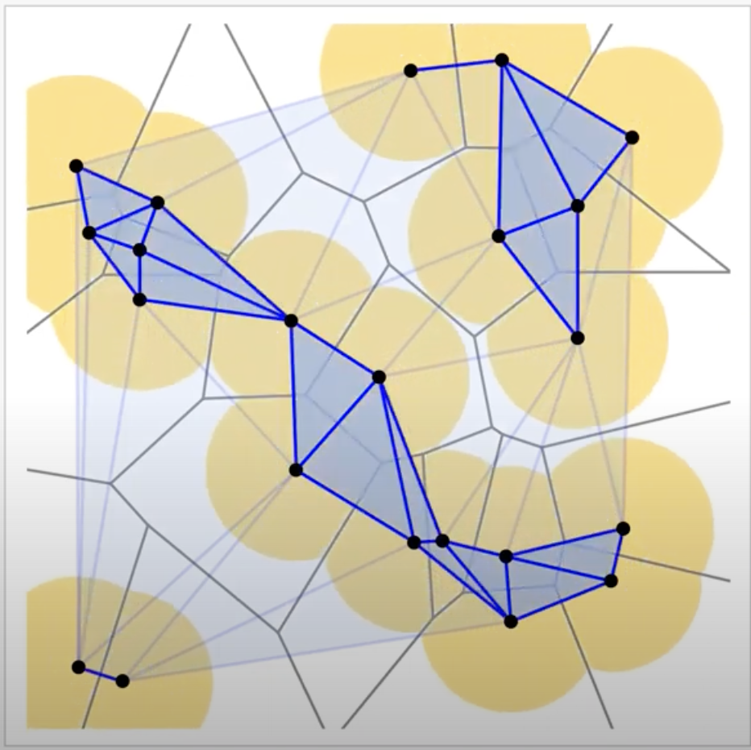

# Delaunay, Voronoi & Alpha Complexes
> - reference video: https://www.youtube.com/watch?v=-XCVn73p3xs
> - Surmmized by [PZQ123456](https://github.com/pzq123456)

在这张图片中，我们可以同时看到 Delaunay, Voronoi，Alpha Complexes 以及以 alpha 为半径的黄色圆盘。在下图中，我们可以看出这几者之间的联系。

> Fig1.
> - 黑色线条为 Voronoi 区域的边界（edges）
> - 浅蓝色三角网为 Delaunay 三角网
> - 深蓝色三角图形组合为 Alpha Complexes
> - 黄色圆盘的半径为 alpha 的值

## 基于 Delaunay 图的 Alpha Complexes 构建（使用 QuadTree 加速）
