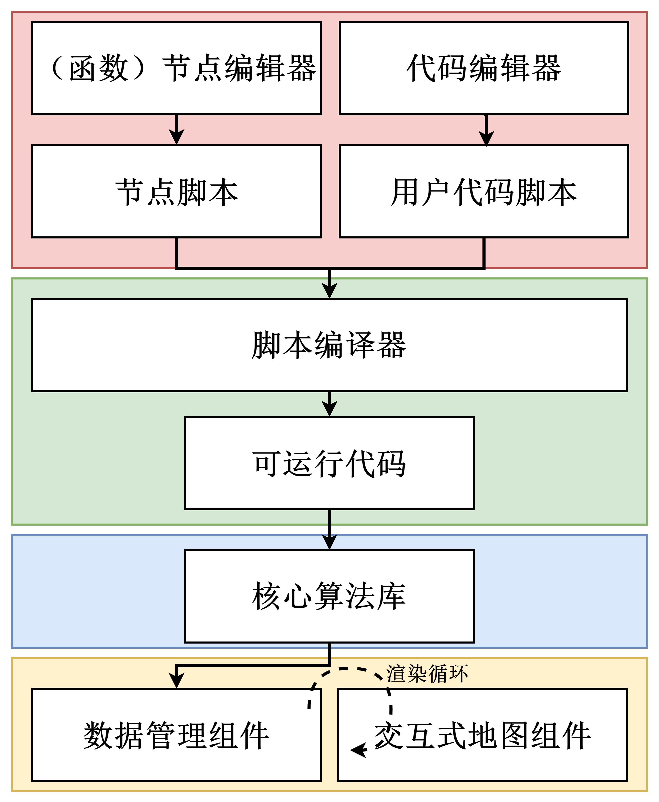
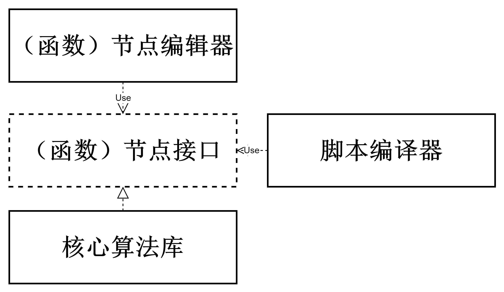
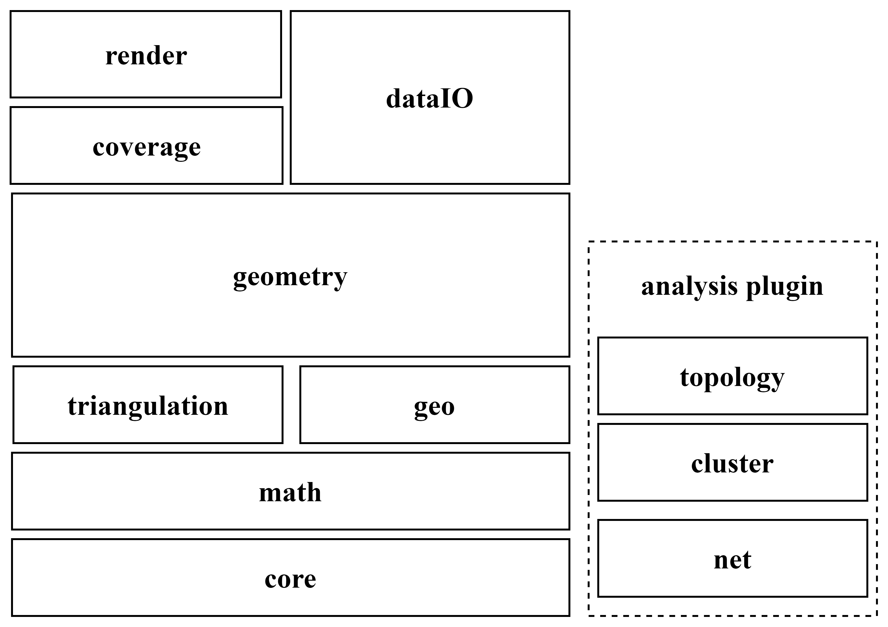

# 第三章 项目总体结构安排与基础算法设计

## 3.1 项目总体结构安排

本项目由脚本编辑模块（包括节点编辑器、代码编辑器）、脚本编译及执行模块、核心算法模块、可视化与交互模块组成。用户不仅可以使用代码编辑器来直接编写函数式数据分析处理脚本，还可以使用节点编辑器进行交互式低代码脚本编辑。用户脚本建模为混合了数据流和控制流的有向无环图（Directed Acyclic Graph）。脚本编译器接受用户脚本，解析并转换为浏览器可直接执行的代码，执行代码返回结果或报错信息。数据管理组件维护一个惰性渲染循环，当地图中需要显示的数据发生变更（增减、改变等），触发地图显示更新（循环正向）。同样的，用户与地图的交互也会导致数据变更，此时会逆向触发导致代码重新执行以更新结果数据（循环逆向）。

节点编辑器会提供系列具有特定数据格式的输入输出节点，这些节点本质上是一组用于描述特定数据转换能力的接口，脚本编译器参照接口名，根据设计好的策略将节点图转换为可以直接运行的代码。
## 3.2 核心算法模块设计

## 3.3 基础算法设计