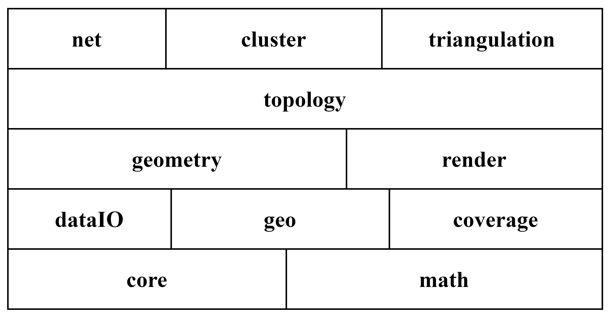

# 第三章 项目总体结构安排与基础算法设计

## 3.1 项目总体结构安排

本项目由脚本编辑模块（包括节点编辑器、代码编辑器）、脚本编译及执行模块、核心算法模块、可视化与交互模块组成。用户不仅可以使用代码编辑器来直接编写函数式数据分析处理脚本，还可以使用节点编辑器进行交互式低代码脚本编辑。用户脚本建模为混合了数据流和控制流的有向无环图（Directed Acyclic Graph）。脚本编译器接受用户脚本，解析并转换为浏览器可直接执行的代码，执行代码返回结果或报错信息。数据管理组件维护一个惰性渲染循环，当地图中需要显示的数据发生变更，则触发地图显示更新。同样的，用户与地图的交互也会导致数据变更，此时会逆向触发导致代码重新执行以更新结果数据。

节点编辑器会提供系列具有特定数据格式的输入输出节点，这些节点本质上是一组用于描述特定数据转换能力的接口，脚本编译器参照接口名，根据设计好的策略将节点图转换为可以直接运行的代码。

## 3.2 核心算法库模块化设计

本项目的核心是一套使用 TypeScript 语言开发的、独立于用户界面的核心算法库。在基础之上，再合理利用现代浏览器开发界面，实现基础功能及高级分析功能。

算法库本身由众多具模块组成，这些模块又可以根据依赖关系划分出不同的层级，下图是粗略的模块示意图，纵向上存在依赖关系。

  - 核心模块（core）：用于实现事件系统、类集成系统等与具体算法无关但与项目设计模式的实现高度相关的核心代码，是整个代码库的核心。
  - 数学模块（math）：该模块专注于纯数学场景下的算法，实现了一套空间矢量计算函数集、单位球球面量测函数集及复数计算（用于傅立叶分析）函数集以及单位换算函数集。可以通过联合本模块与地理模块实现地球表面的量测，得益于这样的低耦合设计，用户甚至可以十分方便地实现其他非地星球的量测函数集。
  - 数据交换模块（dataIO）：该模块负责数据解析、数据格式转换、内部对象生产等功能。目前支持 GeoJSON 文件、TopoJSON 文件读取与输出。通过实现对应的接口，用户也可以根据需要使用其他算法包来拓展该模块的功能。
  - 地理模块（geo）：该模块实现处理坐标系的系列功能，该模块包含两方面内容，坐标系及投影。目前主要实现的是 EPSG:3857 坐标系，该坐标系使用球形墨卡托投影将 EPSG:4326 也就是 WGS84 坐标系下的经纬度坐标投影到平面上。该模块设计时参考了 LeafLet 的实现，使用对象组合技术在保持代码简洁的同时提供较好的灵活性。用户可以基于基础类实现自己的投影及坐标系。
  - 栅格数据模块（coverage）：该模块
  - 地理矢量几何体模块（geometry）：参考 GeoJSON 最新标准，实现 GeoJSON 对象的读取、修改与输出。该模块用于描述用户可以操纵的地理几何对象，是地理信息系统交互、信息交换等功能实现的核心。该模块通过抽象类、继承及接口机制，在保证代码简洁的同时提供优越的可拓展性。

  - 拓扑模块：主要用于实现基础的空间拓扑计算，譬如线段求交、多边形求交等。
  - 空间分析模块：该模块是一个相对复杂的模块，在复用上述基础代码的同时，实现面向矢量数据、栅格数据、网络数据的空间分析算法。该模块可以视为一个可拓展算法的工具箱。
  - 渲染模块：该模块主要负责数据渲染，会根据渲染方式分为若干部分。在开发阶段会首先实现基于 Canvas 的二维渲染模块，在后续集成阶段会使用更加成熟的地图框架（如 LeafLet）。
  - 交互控制模块：提供基础的交互功能，以透明图层的方式捕捉用户操作。

## 3.3 基础算法设计