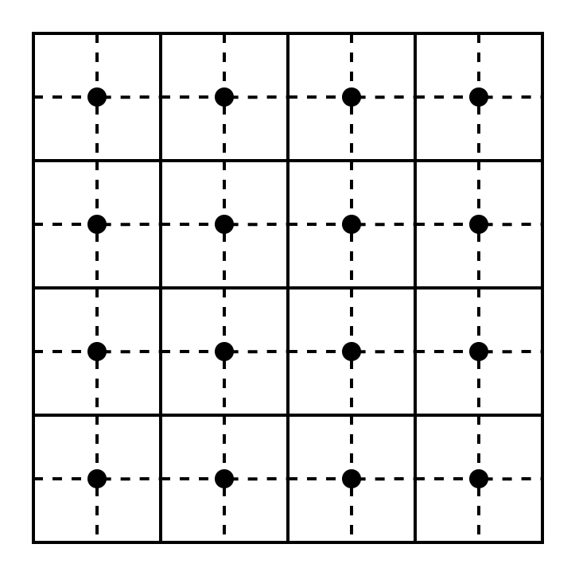

# 算法章节

## 栅格路径规划算法设计
路径规划算法一般针对图（由节点和弧段组成）所表示的路网数据进行（单源、多源）最小代价路径生成。求解最短路径的算法对于处理栅格数据也十分有用，例如我们可以根据地形数据计算水流路径等。如果我们将栅格数据视作一种特殊的图，则可以复用针对一般节点图的路径规划算法来处理栅格数据。栅格数据可以根据需要转化为每个节点都是四连通的图，同样的，某一栅格与其邻接栅格连通的权值可以根据某一规则由已有的栅格值计算出来。

对于一般的图表示的路网数据，我们至少有两点认识：1）距离：从图中一个节点到另一个节点的代价，代价越大距离越远。2）方向：从起点指向终点的向量可作为路径取舍的度量指标。对于栅格数据，我们还可以根据其特性做出特别的优化，比如在栅格中的代价可以使用经过的栅格数来表达，这样就可以避免使用高复杂度的代价计算函数。

由简单到复杂实现路径规划算法可以大致分为三个步骤：1）广度优先搜索(Breadth First Search)：在所有方向上均匀遍历数据。2）统一代价查询(Uniform Cost Search)：该算法会选择使得整体代价最小的路径，例如 Dijkstra 算法。3）启发式算法：例如 A* 算法，该算法是针对某一特定的方向使用启发式函数优化的 Dijkstra 算法，极端情况下会退化为 Dijkstra 算法。

## References
- 移动正方形: https://en.wikipedia.org/wiki/Marching_squares
- A 星: https://www.redblobgames.com/pathfinding/a-star/introduction.html