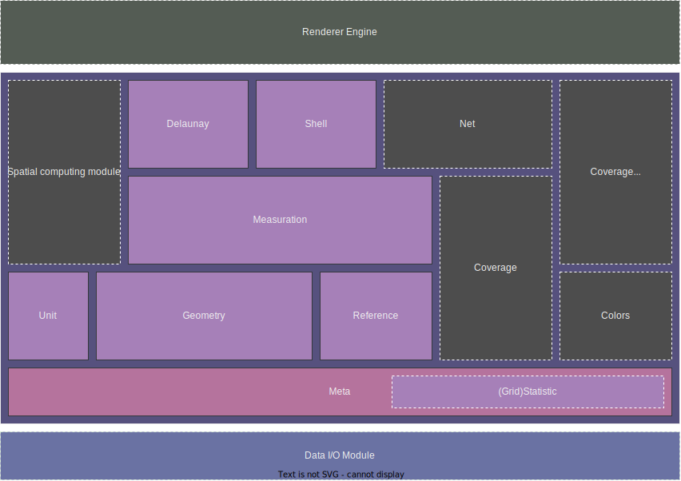

# 教程 | Tutorial
> - 为 `RVGeo v2.0` 编写的教程
> - Tutorial for `RVGeo v2.0`
## 本包的潜在优势
- 便捷快速地引入基础空间分析算法
- 跨地图服务商的一致性开发体验
## 总览 | Overview

> 图片说明：
>  - 虚线框中代表尚未实现（或正在实现）的模块
>  - 模块在纵向存在依赖（一定的）关系，且左侧部分为矢量数据提供支持，右侧为栅格数据
>  - 核心包与插件系统：紫色实线矩形代表 RVGeo 2.0 的核心包，蓝色虚线矩形代表数据 I/O 插件（设计用于解析和生成不同格式的数据），顶部灰色虚线矩形代表渲染引擎
>  - Renderer Engine 模块：该模块采用类似于 UNIX 的插件思想，将针对不同的地图服务提供商实现统一的基础图形绘制方法，以获得跨地图服务的一致开发体验。另外，该模块还将集成三维地形渲染与基础图表渲染。现考虑将其作为独立于 RVGeo 核心包的插件库发布。
>  - 开发阶段架构可能会有所出入，预计（从现在起）一年左右完成全部开发计划